# 01.01. Commercial Web Application Framework - Solution Architecture

The 

<table>
  <tr>
   <td><strong>Owning Architect</strong>
   </td>
   <td><a href="https://morrisons.atlassian.net/wiki/people/5b6c5a6be6dba529eefdb77f?ref=confluence">Sougata Sarkar</a>
   </td>
  </tr>
  <tr>
   <td>Supporting Architects
   </td>
   <td> <a href="https://morrisons.atlassian.net/wiki/people/612fa997f0bf5200694af408?ref=confluence">Sal Kabay</a>, <a href="https://morrisons.atlassian.net/wiki/people/5cd2977f3b428d0dcd7c2881?ref=confluence">Sourav Parui</a>, <a href="https://morrisons.atlassian.net/wiki/people/5f8e79ae6bc6340068c6f942?ref=confluence">Maruthi Sreedhar Mathukumalli (Unlicensed)amit (Unlicensed)</a> 
   </td>
  </tr>
  <tr>
   <td>Jira
   </td>
   <td><a href="https://morrisons.atlassian.net/browse/ARCH-1240">https://morrisons.atlassian.net/browse/ARCH-1240</a>, <a href="https://morrisons.atlassian.net/browse/ARCH-1337">https://morrisons.atlassian.net/browse/ARCH-1337</a>
   </td>
  </tr>
</table>

# Key Stakeholders

---

<table>
  <tr>
   <td><strong>Area</strong>
   </td>
   <td><strong>Stakeholder</strong>
   </td>
   <td><strong>Interest</strong>
   </td>
  </tr>
  <tr>
   <td>TCS Project Manager
   </td>
   <td><a href="https://morrisons.atlassian.net/wiki/people/5cd2ce6727454f0fe457985e?ref=confluence">Nagesh Viswanathan (Unlicensed)</a>
   </td>
   <td>The solution meets the requirements and can be delivered within budget.
   </td>
  </tr>
  <tr>
   <td>TCS Solution Architect
   </td>
   <td><a href="https://morrisons.atlassian.net/wiki/people/5b6c5a6be6dba529eefdb77f?ref=confluence">Sougata Sarkar</a>
   </td>
   <td>Primary Responsibility of the design
   </td>
  </tr>
  <tr>
   <td>TCS Lead Architect
   </td>
   <td><a href="https://morrisons.atlassian.net/wiki/people/60a4f9859b362f006907d603?ref=confluence">Sudhir Mahapatra</a>
   </td>
   <td>Accountability of the Solution Design
   </td>
  </tr>
  <tr>
   <td>Business Sponsor
   </td>
   <td>
   </td>
   <td>
   </td>
  </tr>
  <tr>
   <td>Enterprise Architecture
   </td>
   <td><a href="https://morrisons.atlassian.net/wiki/people/557058:65e0e599-b45b-45c4-80ba-280c1bbf6935?ref=confluence">Matthew Henderson</a>
   </td>
   <td>
   </td>
  </tr>
  <tr>
   <td>Operations Lead
   </td>
   <td><a href="https://morrisons.atlassian.net/wiki/people/557058:6ee65650-599d-432b-a35e-bf4a482d1850?ref=confluence">Michael Forbes</a>
   </td>
   <td>
   </td>
  </tr>
  <tr>
   <td>Third Parties
   </td>
   <td>
   </td>
   <td>
   </td>
  </tr>
  <tr>
   <td>Morrisons Project Manager
   </td>
   <td><a href="https://morrisons.atlassian.net/wiki/people/604a3a9a43eac6006f8f8c31?ref=confluence">Lucy Howard</a>
   </td>
   <td>The solution meets the requirements and can be delivered within budget.
   </td>
  </tr>
  <tr>
   <td>Technical Architects
   </td>
   <td><a href="https://morrisons.atlassian.net/wiki/people/612fa997f0bf5200694af408?ref=confluence">Sal Kabay</a>

<a href="https://morrisons.atlassian.net/wiki/people/611ce286be6c43007049b73f?ref=confluence">Utpal Dutta (Unlicensed)</a>

<a href="https://morrisons.atlassian.net/wiki/people/5cd2977f3b428d0dcd7c2881?ref=confluence">Sourav Parui</a>
   </td>
   <td>Technical design ownership of the solution
   </td>
  </tr>
</table>

Document Approvals

<table>
  <tr>
   <td><strong>Role</strong>
   </td>
   <td><strong>Stakeholder</strong>
   </td>
   <td><strong>Date</strong>
   </td>
   <td><strong>Note/Comment</strong>
   </td>
  </tr>
  <tr>
   <td>Enterprise Lead Architect
   </td>
   <td><a href="https://morrisons.atlassian.net/wiki/people/557058:65e0e599-b45b-45c4-80ba-280c1bbf6935?ref=confluence">Matthew Henderson</a>
   </td>
   <td>
   </td>
   <td>Signed off pre TDA review.
   </td>
  </tr>
  <tr>
   <td>TCS Lead Architect (HBTW)
   </td>
   <td><a href="https://morrisons.atlassian.net/wiki/people/60a4f9859b362f006907d603?ref=confluence">Sudhir Mahapatra</a>
   </td>
   <td>
   </td>
   <td>
   </td>
  </tr>
</table>

# Contents

---

* [Key Stakeholders](#bookmark=id.30j0zll)
* [Conceptual Architecture](#bookmark=id.30j0zll) 
    * [Introduction & Scope](#bookmark=id.30j0zll)
    * [Phasing / Releases](#bookmark=id.30j0zll)
    * [Solution Context](#bookmark=id.30j0zll)
    * [Component List & Rationale](#bookmark=id.30j0zll)
    * [Integration Flows Overview](#bookmark=id.30j0zll)
    * [Decommissioning](#bookmark=id.30j0zll)
    * [Other Architectures Considered](#bookmark=id.30j0zll)
    * [Architectural Alignment](#bookmark=id.30j0zll) 
        * [Architectural Principles RAG](#bookmark=id.30j0zll)
        * [Policy Exceptions](#bookmark=id.30j0zll)
    * [Cross System Impacts](#bookmark=id.30j0zll)
* [Domain Model](#bookmark=id.30j0zll)
* [Non Functional Requirements](#bookmark=id.30j0zll)
* [Solution Architecture](#bookmark=id.30j0zll) 
    * [Solution Blueprint](#bookmark=id.30j0zll)
    * [Component level design](#bookmark=id.30j0zll) 
        * [Commercial Web Application - Dashboard and User Module](#bookmark=id.30j0zll)
        * [Commercial Web Application Services](#bookmark=id.30j0zll)
        * [Camunda Workflow Engine](#bookmark=id.30j0zll)
    * [Application Use Cases](#bookmark=id.30j0zll) 
        * [User Log In](#bookmark=id.30j0zll)
        * [User Workflow Management](#bookmark=id.30j0zll)
    * [Services/APIs](#bookmark=id.30j0zll) 
        * [User Management Application Service](#bookmark=id.30j0zll)
        * [Camunda APIs](#bookmark=id.30j0zll)
        * [Other APIs used](#bookmark=id.30j0zll)
    * [Packaged Modifications](#bookmark=id.30j0zll)
    * [Cutover / Transition Design](#bookmark=id.30j0zll)
* [Infrastructure Architecture](#bookmark=id.30j0zll) 
    * [Commercial Web App](#bookmark=id.30j0zll)
    * [Commercial Web App Service - User Management](#bookmark=id.30j0zll)
    * [Camunda](#bookmark=id.30j0zll) 
        * [BPMN Process Engine Implementation](#bookmark=id.30j0zll)
        * [Deployment Model](#bookmark=id.30j0zll)
        * [Standalone (Remote) Process Engine Server](#bookmark=id.30j0zll)
        * [AWS Fargate](#bookmark=id.30j0zll)
        * [Infrastructure](#bookmark=id.30j0zll)
        * [Camunda Engine Hardware & Sizing](#bookmark=id.30j0zll)
        * [Camunda Database](#bookmark=id.30j0zll)
        * [Database Sizing](#bookmark=id.30j0zll)
        * [Development Environment](#bookmark=id.30j0zll)
    * [Capacity Planning](#bookmark=id.30j0zll)
    * [Capacity Constraints](#bookmark=id.30j0zll)
    * [Capacity Reporting](#bookmark=id.30j0zll)
    * [Scalability and Elasticity](#bookmark=id.30j0zll)
    * [Security Consideration](#bookmark=id.30j0zll)
    * [The Single-page Application development with Responsive and scalability.](#bookmark=id.30j0zll)
* [Information Architecture](#bookmark=id.30j0zll)
* [Operations Architecture](#bookmark=id.30j0zll) 
    * [Security / Compliance](#bookmark=id.30j0zll) 
        * [User Management Services](#bookmark=id.30j0zll)
        * [Camunda Workflow Service](#bookmark=id.30j0zll)
    * [Monitoring and Support Architecture](#bookmark=id.30j0zll) 
        * [User Management Services](#bookmark=id.30j0zll)
        * [Camunda Workflow Service](#bookmark=id.30j0zll)
    * [Maintenance](#bookmark=id.30j0zll) 
        * [User Management Services](#bookmark=id.30j0zll)
        * [Camunda Workflow Service](#bookmark=id.30j0zll)
    * [Deployment / Release Management](#bookmark=id.30j0zll)
* [Assumptions, Risks, Issues and Decisions](#bookmark=id.30j0zll)
* [Peer Review](#bookmark=id.30j0zll) 
    * [Version 1 Review](#bookmark=id.30j0zll)
* [Document Control](#bookmark=id.30j0zll)

# Conceptual Architecture

---

## Introduction & Scope

The Organisation has identified many risks and issues associated with the quality and timeliness of the current Range Amendment and Reset processes that handle the de-ranging and delisting of products and management of the associated information. These challenges are compounded by the workflow variations of activities and timelines for managing the process across a sub-set of categories. A new strategic web-based solution with a BPMN process engine serving as a critical automation and orchestration layer. The new solution will deliver improved integration and a streamlined RAF process across the business and include a broader range of categories. Based on Camunda, this solution will systemise all critical manual processes to reduce the need for manual human interaction and provide greater visibility to all associated colleagues, thus reducing human error, improve time management and enhance the traders ability to manage their portfolio of Suppliers and reduce wastage. 

<table>
  <tr>
   <td><strong>In Scope</strong>
   </td>
   <td><strong>Out of Scope</strong>
   </td>
  </tr>
  <tr>
   <td>
<ul>

<li>Web App UI - User Module

<li>Commercial User App Service

<li>Camunda Workflow Engine implementation with User management workflows

<li>Integration of JML report from Colleague V1 Batch service
</li>
</ul>
   </td>
   <td>Key callouts for out of scope items
   </td>
  </tr>
</table>

## Phasing / Releases

## Solution Context

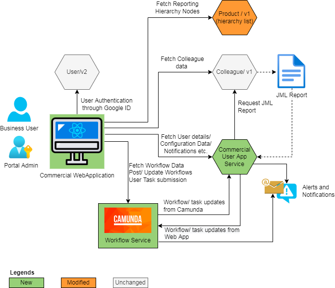

## Component List & Rationale

<table>
  <tr>
   <td><strong>Component</strong>
   </td>
   <td><strong>Component Description</strong>
   </td>
   <td><strong>Rationale</strong>
   </td>
  </tr>
  <tr>
   <td>Commercial Web Application
   </td>
   <td>The commercial web app will be a new Progressive and Responsive web application that will be accessed by the business users through various devices (Primarily Desktop, Laptop, Surface Pro tablets, also mobile phones and other tablets). The web application will have multiple modules. This solution focuses on the Task dashboard and the User Module that will be the backbone for the other functional modules like - Range Reset App, Promotion App and Price Change App.
   </td>
   <td>New component - the UI will be built as the framework for the Commercial Web Application
   </td>
  </tr>
  <tr>
   <td>Commercial User Application Service
   </td>
   <td>The Commercial User Application service will be the backbone of the User module as well as provide the user “authorisation” details for all other Commercial Web Application modules. This service will have its own database, file storage, microservices and REST API endpoints. The API endpoints will be configured in Apigee.
   </td>
   <td> \
New Component - The back end application service to support the Commercial Web App - User Management module
   </td>
  </tr>
  <tr>
   <td>Camunda Workflow Engine
   </td>
   <td>Camunda is an enterprise workflow management solution. The Camunda will be implemented as a back end workflow engine for teh Commercial Webapp. The workflows will be configured in Camunda for various business processes that will be supported by different modules within the Commercial Web App. The Commercial Web App and the Application service will interact with Camunda through the native REST APIs. These APIs will also be configured in Apigee.
   </td>
   <td> \
New Component - the enterprise workflow engine to define the business process workflows for the Commercial Web Application - User Management module
   </td>
  </tr>
  <tr>
   <td>User V2
   </td>
   <td>The user will log in to the Commercial web app using the Morrisons Google ID. The user authentication will be done using the User V2 service.
   </td>
   <td> \
Existing component - will be used for user authentication in the Commercial Web App
   </td>
  </tr>
  <tr>
   <td>Colleague v1 and JML Report
   </td>
   <td>Colleague V1 service will be used in two scenarios - 
<ul>

<li>The Web app will invoke the service to fetch the colleague details when the user invokes the User create, modify or remove requests.

<li>The User App service will invoke the batch download method to download the Joiners, Movers and Leavers (JML) report
</li>
</ul>
   </td>
   <td> \
Existing component - will be used to fetch colleague data and JML report
   </td>
  </tr>
  <tr>
   <td>Product Hierarchy Service
   </td>
   <td>The UserModule will require to fetch the list of Reporting Hierarchy from the product hierarchy service. This is required to link the Hierarchy levels to the User Groups to restrict the data level access for the users.
   </td>
   <td>A new endpoint is required to fetch the hierarchy data in a more efficient manner

<a href="file:////wiki/spaces/HCWCPT/pages/3663431494/01.01.03+TDD%253A+Hierarchy+Service+-+New+GET+Endpoint">01.01.03 TDD: Hierarchy Service - New GET Endpoint</a> 
   </td>
  </tr>
</table>

## Integration Flows Overview

<table>
  <tr>
   <td>S.No
   </td>
   <td>Workstream
   </td>
   <td>Phase/ Drop
   </td>
   <td>Interface Name
   </td>
   <td>Interface Change Description
   </td>
   <td>Source
   </td>
   <td>Target
   </td>
   <td>New / Amend / Decomm
   </td>
   <td>Extract Type 
   </td>
   <td>Frequency
   </td>
  </tr>
  <tr>
   <td>HBTW136
   </td>
   <td>Range Amendment and RAF
   </td>
   <td>Drop 1
   </td>
   <td>Colleague Service to Commercial User App Service - JML Report
   </td>
   <td>Joiner, Movers and Leavers report download
   </td>
   <td>Colleague V1
   </td>
   <td>Commercial User App Service
   </td>
   <td>New
   </td>
   <td>Delta - File based
   </td>
   <td>Batch - Once a day

Scheduled on Cloudwatch - 21:30 hrs
   </td>
  </tr>
</table>

* The Commercial User App - JML microservice will invoke the Colleague v1 API, path /colleagues: to request with 
    * scope as “JOINER” or “MOVER” or “LEAVER” 
    * FromDate: &lt;Current Date -1>
    * ToDate: &lt;Current Date>
* Download the Joiner, Mover, or Leaver report from the path specified by the Colleague v1 - GCP path
* The JML microservice will then filter the data and map to the application-specific roles and generate the appropriate workflows in Camunda

## Decommissioning

Not Applicable for this development

## Other Architectures Considered

[https://docs.google.com/presentation/d/1QRT-9aCvvqrBnPAdOWhIfnu2W5O3nrmmbmRatwto4iM/edit?usp=sharing](https://docs.google.com/presentation/d/1QRT-9aCvvqrBnPAdOWhIfnu2W5O3nrmmbmRatwto4iM/edit?usp=sharing) 

## Architectural Alignment

### Architectural Principles RAG

Link to principles: [Enterprise Architecture Principles](file:////wiki/spaces/EA/pages/50767223/Principles%252C+Practices+and+Patterns)

The status categories below imply:

* Red - Multiple principle conflicts and significant technical debt that must be mitigated in future project phases.
* Amber - Minor principal conflicts, the technical debt that is introduced is not significant but should be mitigated at some point in the future. 
* Green - The solution is well aligned and no technical debt is created. 

<table>
  <tr>
   <td>
<strong>Top Level Principle</strong>
   </td>
   <td><strong>Status</strong>
   </td>
   <td><strong>Principles affected and rationale</strong>
   </td>
  </tr>
  <tr>
   <td>Simple
   </td>
   <td>GREEN
   </td>
   <td>The objective of the solution is to provide a simple user experience along with a simple operational model
   </td>
  </tr>
  <tr>
   <td>Flexible
   </td>
   <td>GREEN
   </td>
   <td>The UI and workflow designs will be flexible and configurable as much as possible
   </td>
  </tr>
  <tr>
   <td>Secure
   </td>
   <td>GREEN
   </td>
   <td>Every component is secured. The UI, Back End Service and Camunda will interact through secured APIs configured in Apigee
   </td>
  </tr>
  <tr>
   <td>Vision / Roadmap
   </td>
   <td>GREEN 
   </td>
   <td>This will provide a strategic framework for a Web App with an Enterprise Workflow engine.
   </td>
  </tr>
  <tr>
   <td>Principles
   </td>
   <td>GREEN 
   </td>
   <td>Improved efficiency across all business functions within Commercial domain
   </td>
  </tr>
  <tr>
   <td>Policies/Standards
   </td>
   <td>GREEN 
   </td>
   <td>Adhering to the cloud first policy
   </td>
  </tr>
  <tr>
   <td>Re-use
   </td>
   <td>GREEN 
   </td>
   <td>The Camunda Workflow Engine can be reused across applications along with the application framework
   </td>
  </tr>
</table>

### Policy Exceptions

Not Applicable

<table>
  <tr>
   <td><strong>Policy</strong>
   </td>
   <td><strong>Exception</strong>
   </td>
  </tr>
  <tr>
   <td>
   </td>
   <td>
   </td>
  </tr>
  <tr>
   <td>
   </td>
   <td>
   </td>
  </tr>
</table>

## Cross System Impacts

This is completely a new application framework. The User module of the commercial web application will be used by the other functional modules of the Web App. The other modules will have cross-module dependencies which will be documented in the respective solution architecture documents.

# Domain Model

---

[Example Diagrams](file:////wiki/spaces/EA/pages/78217217/Design+Samples) 

# Non Functional Requirements

---

Listed below are requirements that have a direct impact on the architecture and the impact. The list is not exhaustive, please include any others that have a specific impact on the solution. 

Detailed examples can be found here:[https://docs.google.com/spreadsheets/d/1VgYP4t1wPJVZhQKraVP-qXTuROI2pBlhVcpITfitOvk/edit?usp=sharing](https://docs.google.com/spreadsheets/d/1VgYP4t1wPJVZhQKraVP-qXTuROI2pBlhVcpITfitOvk/edit?usp=sharing)

<table>
  <tr>
   <td><strong>Type</strong>
   </td>
   <td><strong>Description</strong>
   </td>
   <td><strong>Architecture Impact</strong>
   </td>
  </tr>
  <tr>
   <td><strong>Audit</strong>
   </td>
   <td>
<ul>

<li>The application should not retain or disclose any personally sensitive information to any unauthorised person. The application should adhere to the GDPR compliance

<li>The Workflow data will be archived after<strong> 7 days</strong> of completion of the workflows. The additional user details fetched from the Colleague V1 service will be removed from the User data when the workflow details are archived

<li>The Archived workflow logs and attachments will be permanently deleted after <strong>90 days </strong>The task header information will be retained for the KPI calculations for <strong>730 days </strong>The Joiners, Movers, Leavers (JML) files downloaded from the Colleague V1 service will be purged from the S3 Bucket after <strong>7days</strong> from the download date
</li>
</ul>
   </td>
   <td>
   </td>
  </tr>
  <tr>
   <td><strong>Capacity</strong>
   </td>
   <td>
<ul>

<li>Expected maximum Data Volume in <strong>RDS: 25 GB </strong>

<li>Expected Data Volume in <strong>S3: 50 GB </strong>

<li>Expected Data Volume in Camunda <strong>DB: 25 GB</strong>

<li><strong>User Count</strong> 
<ul>
 
<li>Though the User module will be used by the Portal Admin team, other business users will heavily use the Dashboard and other modules through a single sign-on: Portal Admin - 5, Business Users (Core) - 300 Business Users (Sporadic) - 500
 
<li><strong>Concurrent Users</strong>  
<ul>
  
<li><strong>Commercial Web App - Dashboard </strong>Peak - 300 Concurrent users (200 Core Users + 100 Sporadic users)<strong> </strong>
  
<li><strong>User Management Module: </strong>Peak - 10 Concurrent users (5 x portal Admin + 5 Business Users)
</li>  
</ul>
</li>  
</ul>
</li>  
</ul>
   </td>
   <td>
   </td>
  </tr>
  <tr>
   <td><strong>Availability</strong>
   </td>
   <td>
<ul>

<li>Hours of operation - The application may be accessed 24x7. The core business hours are Monday to Friday 06:00 to 22:00. The JML Microserce will be running only once a day at 21:00 hrs

<li>The application may be accessed on weekends and bank holidays and also during the non-business hours.

<li>Service need to be available 99.9% during operational period

<li>Maintenance to be undertaken outside business hours 06:50 to 22:00 and over weekends avoiding integration processing times. The planned maintenance should be communicated to the business well in advance.
</li>
</ul>
   </td>
   <td>
   </td>
  </tr>
  <tr>
   <td><strong>Compatibility / Portability</strong>
   </td>
   <td>
<ul>

<li>Standard models for integration (REST)
</li>
</ul>
   </td>
   <td>
   </td>
  </tr>
  <tr>
   <td><strong>Integrity</strong>
   </td>
   <td>
<ul>

<li>All the errors must be logged in the standard logging and must be available for service delivery. Any significant errors must be reported through incidents to the support team. \
There must be alerts configured to monitor the error rates.

<li>All logs must be in datadog and cloudwatch for service delivery. Exceptions management to be reported through incidents to the support team. There must be alerts configured to monitor the error rates in datadog.
</li>
</ul>
   </td>
   <td>
   </td>
  </tr>
  <tr>
   <td><strong>Maintainability / Supportability</strong>
   </td>
   <td>
<ul>

<li>Conformance to architecture standards of Morrisons

<li>Conformance to design standards of Morrisons for web Application, Services and Integrations

<li>Conformance to coding standards for respective technologies- AWS, Java, Camunda, React JS

<li>All failures should be logged as incidents automatically in SM9. The Incidents should be assigned to the respective Level 1 support teams
</li>
</ul>
   </td>
   <td>
   </td>
  </tr>
  <tr>
   <td><strong>Performance</strong>
   </td>
   <td>
<ul>

<li>Though the performance metrices may vary by the API endpoints, in general the following guideline will be applicable to all the REST APIs of the User App services and Camunda 
<ul>
 
<li>Response times / latency - less than 200ms for a transaction. 
 
<li>100 transaction per seconds should be handled by the service 
</li> 
</ul>

<li>Commercial Web Application/ User Module will respond within 2 seconds of user request.

<li>The Housekeeping process will be a batch job running every week. The job should be completed in 15mins. This will take care of all archival and purging.
</li>
</ul>
   </td>
   <td>
   </td>
  </tr>
  <tr>
   <td><strong>Reliability</strong>
   </td>
   <td>
<ul>

<li>Mean Time Between Failures - No more than P1 incidents in a year 

<li>Mean Time To Recovery - recovery time should be with in 4 hours.
</li>
</ul>
   </td>
   <td>
   </td>
  </tr>
  <tr>
   <td><strong>Recovery</strong>
   </td>
   <td>
<ul>

<li>Recovery time scales - Recovery must be possible with in 4 hours

<li>Backups - Data must be backed up everyday and should be recoverable within an hour.
</li>
</ul>
   </td>
   <td>
   </td>
  </tr>
  <tr>
   <td><strong>Scalability</strong>
   </td>
   <td>
<ul>

<li>Horizontal / Vertical - Options at all levels of solution

<li>The application, services and camunda should be configured for high availibility and autoscalling should be enabled with specified limits based on the Performance Test results
</li>
</ul>
   </td>
   <td>
   </td>
  </tr>
  <tr>
   <td><strong>Security</strong>
   </td>
   <td>
<ul>

<li>Users must be able to login using Morrisons Google credentials

<li>User Role must be supported to provide access to features depending on the user role for example Buyer or Supply Chain Analyst etc

<li>Inactivity timeouts
</li>
</ul>
   </td>
   <td>Google Authentication is used to provide access to the Application in addition to the User V2 Service.

Range Reset Service will maintain list of user Roles and the mapping to the Users 
   </td>
  </tr>
  <tr>
   <td><strong>Usability</strong>
   </td>
   <td>
<ul>

<li>Look and feel standards - The Web application should adhere to the colour scheme and other look and feel standards set by Morrisons

<li>Internationalization / localization requirements - Not applicable
</li>
</ul>
   </td>
   <td>
   </td>
  </tr>
  <tr>
   <td><strong>Cost Control</strong>
   </td>
   <td>
<ul>

<li>The operation teams should actively monitor and optimise the allocation and utilisation of infrastructure and support resources

<li>Housekeeping of the data should be done as per the requirements to ensure the unwanted increase in the infrastructure cost

<li>The implementation should use the Serverless services as much as possible
</li>
</ul>
   </td>
   <td>
   </td>
  </tr>
</table>

<table>
  <tr>
   <td><strong>Detailed Non Functional Requirements Link </strong>
   </td>
   <td><a href="https://docs.google.com/spreadsheets/d/1DVc1K3hXHGsDVJ21rpHcOYM8D_MuEmvykx9zTW9Z-Qw/edit?usp=sharing">https://docs.google.com/spreadsheets/d/1DVc1K3hXHGsDVJ21rpHcOYM8D_MuEmvykx9zTW9Z-Qw/edit?usp=sharing</a> 
   </td>
  </tr>
</table>

# Solution Architecture

---

## Solution Blueprint

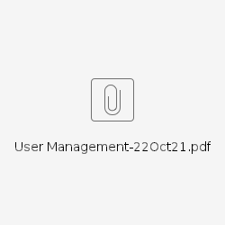

## Component level design

### Commercial Web Application - Dashboard and User Module

The commercial Web Application is a new Web Application framework, particularly for the Commercial Business operations. This application will have multiple functional modules. The framework will provide a single sign on through Google Authentication to the set of applications. On a successful user authentication, the Dashboard will be loaded where the users will be able to see the summary of the pending tasks in application specific widgets. The users will also be able to see the consolidated notification and KPI metrics in the dashboard.

The User module will be a centralised module to manage the Users and their role and data privileges. The Business users will be able to raise User add, modify or remove requests. The Portal Admin users will be able to manage the users by responding to these requests or directly using various screens in the UI. 

The Access to the menu options will be defined based on the user roles. The read, write or view access to the specific screen components (Buttons, Fields, List of Values, etc.) may also be restricted by user roles. On a successful user authentication, the Application will fetch these details from the User App service the web application will dynamically respond to the user configuration.

The User App Wireframes - 

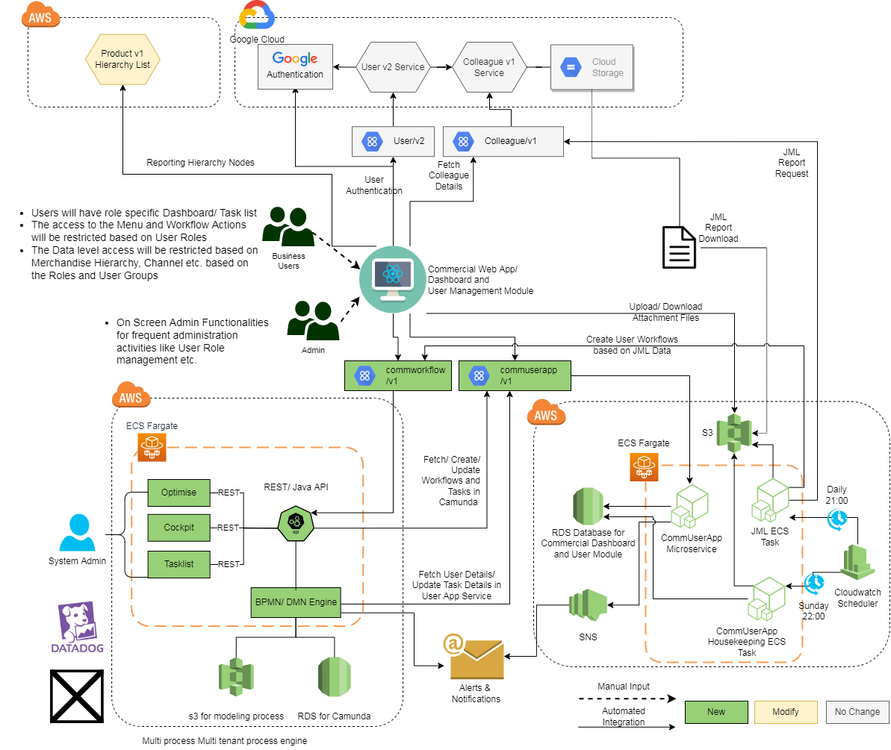

The details of the functional design are available here - [01.01.02.00. Functional Design - User Management](file:////wiki/spaces/HCWCPT/pages/3541959305/01.01.02.00.+Functional+Design+-+User+Management) 

The Details of the technical Design are available here - [01.01.02.01 Technical Design - Web App UI](file:////wiki/spaces/HCWCPT/pages/3465448896/01.01.02.01+Technical+Design+-+Web+App+UI) 

### Commercial Web Application Services

The Commercial Web App services will be the backbone to the Commercial Web Applications. The java microservices will be deployed on ECS Fargate. The User App will consist of the following microservices -

* User App Microservice
* JML Microservice
* Housekeeping Microservice

#### User App Microservice

The User App Microservice will provide multiple REST APIs for the Commercial Web App and Camunda to perform various user related operations described in the Services/ API section. The REST APIs will be configured in Apigee. This microservice will be available 24x7. This will be a very critical service for the entire Commercial Web App as the user authorisation will be done through this microservice. The data will be managed in the Postgres RDS instance which will be accessed through this microservice.

Any file attachments uploaded by the users as part of the user management workflow tasks will be stored in specific S3 bucket.

Technical Design - [01.01.02.02. Technical Design - Commercial User Service v1](file:////wiki/spaces/HCWCPT/pages/3465382007/01.01.02.02.+Technical+Design+-+Commercial+User+Service+v1) 

#### JML Microservice

The JML java microservice will be scheduled in Cloudwatch to run daily once. This service will request Joiners, Movers and Leavers report through Colleague V1 service (Bulk endpoint). The service will then download and process the JML reports and initiate appropriate User management workflows in Camunda.

* The Commercial User App - JML microservice will invoke the Colleague v1 API, path /colleagues: to request with 
    * scope as “JOINER” or “MOVER” or “LEAVER” 
    * FromDate: &lt;Current Date -1>
    * ToDate: &lt;Current Date>
* Download the Joiner, Mover, or Leaver report from the path specified by the Colleague v1 - GCP path
* The JML microservice will then filter the data and map to the application-specific roles and generate the appropriate workflows in Camunda

Technical Design - [01.01.02.04. Technical Design - JML Service](file:////wiki/spaces/HCWCPT/pages/3567682002/01.01.02.04.+Technical+Design+-+JML+Integration+to+Commercial+Web+Application) 

#### Housekeeping Microservice

The housekeeping of the transactional data in the database tables and files in S3 will be managed by this Java microservice. This will be scheduled on Cloudwatch to run weekly once. The archival and purging parameters will be configurable in the system options table.

<table>
  <tr>
   <td><strong>MODULE</strong>
   </td>
   <td><strong>PARAMETER_NAME</strong>
   </td>
   <td><strong>PARAMETER_VALUE</strong>
   </td>
   <td><strong>COMMENTS</strong>
   </td>
  </tr>
  <tr>
   <td>USER
   </td>
   <td>usr_wfl_archive_days
   </td>
   <td>7
   </td>
   <td>Number of days after the completion of workflow, the data will move from TASK_LIST and TASK_LOG tables to TASK_LIST_HIST and TASK_LOG_HIST respectively after the specified number of days. The USER.ADDITIONAL_INFO column will be updated as null (&lt;blank>) as well if there is no other active workflow for the user. The User data should be deleted from the User table if the User Status is “W” and no other active workflow exists for the user. This scenario is applicable if a create user request is rejected by the Admin.
   </td>
  </tr>
  <tr>
   <td>USER
   </td>
   <td>usr_wfl_purge_days
   </td>
   <td>90
   </td>
   <td>Number of days after the archival of workflow data, the data will be permanently purged from the TASK_LOG_HIST. The associated attachment files will be deleted from S3. TASK_LIST_HIST.REQUEST_DATA column will be updated as null.
   </td>
  </tr>
  <tr>
   <td>USER
   </td>
   <td>user_kpi_purge_days
   </td>
   <td>730
   </td>
   <td>Number of days after the archival of the workflow data, the data will be purged from the TASK_LIST_HIST table
   </td>
  </tr>
  <tr>
   <td>USER
   </td>
   <td>user_jml_purge_days
   </td>
   <td>7
   </td>
   <td>Number of days after the Joiners, Movers, Leavers (JML) files downloaded from the Colleague V1 service will be purged from the S3 Bucket
   </td>
  </tr>
</table>

Technical Design - [01.01.02.05. Technical Design - Housekeeping Service](file:////wiki/spaces/HCWCPT/pages/3576632154/01.01.02.05.+Technical+Design+-+Housekeeping+Service) 

### Camunda Workflow Engine

Camunda Enterprise edition will be the strategic workflow solution. Camunda will be implemented specific to a technology domain. The Commercial instance of Camunda will be deployed on Commercial AWS account using AWS ECS Fargate along with Postgres RDS and S3.

Camunda will be implemented as a backend BPMN and DMN workflow engine.

The front end utilities, Tasklist, Cockpit and optimise will only be used by the system administrators

Technical Design - [01.01.02.03 Technical Design - Camunda](file:////wiki/spaces/HCWCPT/pages/3465448941/01.01.02.03+Technical+Design+-+Camunda) 

## Application Use Cases

### User Log In

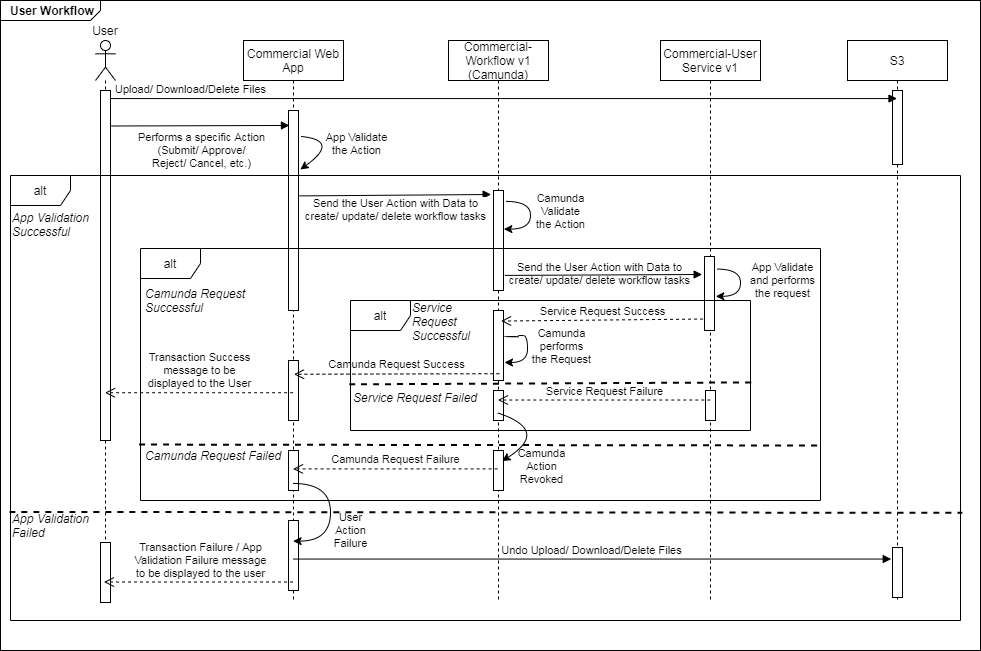

### User Workflow Management

The User will be able to Create a new User Management (Add User, Modify User or Remove User) request or act of an existing request from the User management App. When the user clicks on any of the action buttons on the UI, the application will perform the on screen validation before sending the request to Camunda by invoking the REST APIs. Camunda will internally perform the validations and invoke the User App service APIs to perform the action in the service. If all the requests are successfully processed, the the requested action will be performed in Camunda and the Service. In case of failure, the action will not be performed. The user will be notified the success or failure in the UI.

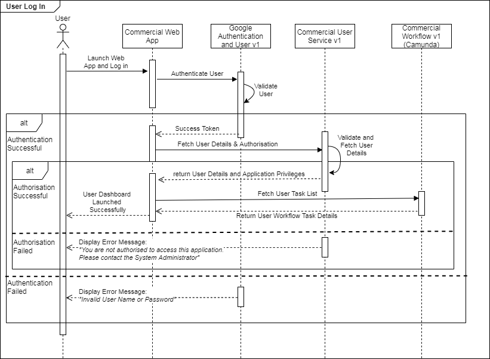

## Services/APIs

### User Management Application Service

The User Management application service will be dedicated to the Commercial Web App. This service will be used by the Web app as well as Camunda User workflows.

**api.morrisons.com/commercial-user/v1**

<table>
  <tr>
   <td><strong>Apigee Endpoints</strong>
   </td>
   <td><strong>Description</strong>
   </td>
  </tr>
  <tr>
   <td>GET /apps

GET /apps/{appMenuId}
   </td>
   <td>This endpoint will be used to get web app menu items based on menuId or all menu id
   </td>
  </tr>
  <tr>
   <td>GET /userdetails/{userId}

GET /userdetails

PUT /userdetails/{userId}
   </td>
   <td>This end points will be used to get user details and to create/update a user details 
   </td>
  </tr>
  <tr>
   <td>GET /roles/{roleId}

GET /roles
   </td>
   <td>This end points will be used to get the roles based on their ids
   </td>
  </tr>
  <tr>
   <td>GET /usergroups/{groupId}

GET /usergroups

PUT /usergroups/{groupId}
   </td>
   <td>This end points will be used to get and update the user groups based on group id
   </td>
  </tr>
  <tr>
   <td>GET /tasklist/{requestId}

GET /tasklist

PUT /tasklist
   </td>
   <td>This end points will be used to get and update the task lists based on request id
   </td>
  </tr>
  <tr>
   <td>GET /tasklog/{requestId}

GET /tasklog

POST /tasklog/{requestId}
   </td>
   <td>This end points will be used to get and update the task log based on request id
   </td>
  </tr>
</table>

### Camunda APIs

[api.morrisons.com/commercial-workflow/v1/userapp](http://api.morrisons.com/commercial-workflow/v1/userapp)

For the latest version of the APIGEE endpoints please see [https://morrisons.atlassian.net/wiki/spaces/HCWCPT/pages/3465448941/01.01.02.03+Technical+Design+-+Camunda#Services](https://morrisons.atlassian.net/wiki/spaces/HCWCPT/pages/3465448941/01.01.02.03+Technical+Design+-+Camunda#Services) .

<table>
  <tr>
   <td><strong>Apigee Endpoints</strong>
   </td>
   <td><strong>Description</strong>
   </td>
   <td><strong>Microservices</strong>
   </td>
  </tr>
  <tr>
   <td>
<ul>

<li><strong>PUT  /userdetails/{userId}</strong>

<li>Verb: PUT
</li>
</ul>
   </td>
   <td>
<ul>

<li>This method is used to Create a User Access Request by providing the user ID and user details payload as defined by the <strong>User Management Application Service</strong>

<li>This will be used by the <strong>User Management Application UI </strong>for individual requests and also by the <strong>User Management Application Service</strong> where bulk requests are implemented for Joiners/Movers/Leavers
</li>
</ul>
   </td>
   <td>
<ul>

<li>The PUT method will instantiate a Camunda User Workflow Process Definition that will manage the approvals process for the request

<li>The approvals process will interact with the <strong>User Management Application Service</strong> via the published API to fetch and update back end data model dependencies and validate all responses during the execution of the approvals workflow

<li>All application data will be managed by the <strong>Management Application Service</strong> and all approvals workflow user and service tasks will be maintained by the Camunda Platform data model 

<li>The workflow instance will instantiate and allocate human work tasks to provide approvals before a the user request is fulfilled and manage the exceptions that occur with follow-up human tasks.

<li>The workflow service will update the <strong>User Management Application UI </strong>with appropriate responses to notify the status of requests with appropriate codes.
</li>
</ul>
   </td>
  </tr>
  <tr>
   <td>
<ul>

<li><strong>DELETE  /userdetails/{userId}</strong>

<li>Verb: DELETE
</li>
</ul>
   </td>
   <td>
<ul>

<li>This method is used to Create a User Access Request by providing the user ID and user details payload as defined by the <strong>User Management Application Service</strong>

<li>This will be used by the <strong>User Management Application UI </strong>for individual requests and also by the <strong>User Management Application Service</strong> where bulk requests are implemented for Joiners/Movers/Leavers
</li>
</ul>
   </td>
   <td>
<ul>

<li>The DELETE method will instantiate a Camunda User Workflow Process Definition that will manage the approvals process for the request

<li>The approvals process will interact with the <strong>User Management Application Service</strong> via the published API to fetch and update back end data model dependencies and validate all responses during the execution of the approvals workflow

<li>All application data will be managed by the <strong>Management Application Service</strong> and all approvals workflow user and service tasks will be maintained by the Camunda Platform data model 

<li>The workflow instance will instantiate and allocate human work tasks to provide approvals before a the user request is fulfilled and manage the exceptions that occur with follow-up human tasks.

<li>The workflow service will update the <strong>User Management Application UI </strong>with appropriate responses to notify the status of requests with appropriate codes.
</li>
</ul>
   </td>
  </tr>
  <tr>
   <td>
<ul>

<li><strong>GET /tasks{userId}</strong>

<li>Verb: GET
</li>
</ul>
   </td>
   <td>
<ul>

<li>The API is used to fetch the list of active workflow tasks pending for a user admin given the input userId

<li>The Response will provide all the allocated active human tasks as defined in the workflow process

<li>A unique process instance transaction id will also be made available to the consumer which can be used to fetch through the user request details that are stored in the <strong>User Management Application Service</strong> data model.
</li>
</ul>
   </td>
   <td>
<ul>

<li>The Camunda workflow engine will be queried for all active human tasks assigned to the requested userId and the unique process instance id returned to the consumer as a list of tasks.
</li>
</ul>
   </td>
  </tr>
  <tr>
   <td>
<ul>

<li><strong>GET /tasks/unassigned</strong>

<li>Verb: GET
</li>
</ul>
   </td>
   <td>
<ul>

<li>The API is used to fetch the list of unassigned workflow tasks that are awaiting to be claimed or assigned to human users

<li>The Response will provide all the allocated active human tasks as defined in the workflow process

<li>A unique process instance transaction id will also be made available to the consumer which can be used to fetch through the unassigned user request details that are stored in the <strong>User Management Application Service</strong> data model.
</li>
</ul>
   </td>
   <td>
<ul>

<li>The Camunda workflow engine will be queried for all active human tasks that are unassigned with the associated unique process instance id returned to the consumer as a list of tasks.
</li>
</ul>
   </td>
  </tr>
  <tr>
   <td>
<ul>

<li><strong>GET /tasks/completed</strong>

<li>Verb: GET
</li>
</ul>
   </td>
   <td>
<ul>

<li>The API is used to fetch the list of completed workflow tasks that have not yet been archived 

<li>The Response will provide all the completed human tasks as executed by the workflow process

<li>A unique process instance transaction id will also be made available to the consumer which can be used to fetch through the unassigned user request details that are stored in the <strong>User Management Application Service</strong> data model.
</li>
</ul>
   </td>
   <td>
<ul>

<li>The Camunda workflow engine will be queried for all completed human tasks with the associated unique process instance id returned to the consumer as a list of tasks.
</li>
</ul>
   </td>
  </tr>
  <tr>
   <td>
<ul>

<li><strong>GET /tasks/rejected</strong>

<li>Verb: GET
</li>
</ul>
   </td>
   <td>
<ul>

<li>The API is used to fetch the list of rejected workflow tasks that have not yet been archived 

<li>The Response will provide all the rejected human tasks as executed by the workflow process

<li>A unique process instance transaction id will also be made available to the consumer which can be used to fetch through the unassigned user request details that are stored in the <strong>User Management Application Service</strong> data model.
</li>
</ul>
   </td>
   <td>
<ul>

<li>The Camunda workflow engine will be queried for all rejected human tasks with the associated unique process instance id returned to the consumer as a list of tasks.
</li>
</ul>
   </td>
  </tr>
  <tr>
   <td>
<ul>

<li><strong>GET /tasks/late</strong>

<li>Verb: GET
</li>
</ul>
   </td>
   <td>
<ul>

<li>The API is used to fetch the list of active workflow tasks that have exceeded the allotted due date

<li>The Response will provide all the late human tasks as executed by the workflow process

<li>A unique process instance transaction id will also be made available to the consumer which can be used to fetch through the unassigned user request details that are stored in the <strong>User Management Application Service</strong> data model.
</li>
</ul>
   </td>
   <td>
<ul>

<li>The Camunda workflow engine will be queried for all human tasks that have triggered an SLA exception with the associated unique process instance id returned to the consumer as a list of tasks.
</li>
</ul>
   </td>
  </tr>
</table>

### Other APIs used

<table>
  <tr>
   <td><strong>Apigee Endpoints</strong>
   </td>
   <td><strong>Description</strong>
   </td>
   <td><strong>Documents</strong>
   </td>
  </tr>
  <tr>
   <td>
<ul>

<li>/user/v2/token

<li>Verb: POST, DELETE
</li>
</ul>
   </td>
   <td>
<ul>

<li>User Authentication - Generate, Refresh, Delete user tokens
</li>
</ul>
   </td>
   <td><a href="file:////wiki/spaces/SC/pages/1187710318">user/v2</a> , <a href="file:////wiki/spaces/API/pages/66125994/MOR+User+API+v2">MOR User API v2</a> 
   </td>
  </tr>
  <tr>
   <td>
<ul>

<li>colleague/v1

<li>GET:/colleagues/*
</li>
</ul>
   </td>
   <td>
<ul>

<li>Get a Colleague data
</li>
</ul>
   </td>
   <td><a href="file:////wiki/spaces/SC/pages/50373519/Colleague">Colleague</a> , <a href="file:////wiki/spaces/API/pages/51088550/MOR+Colleague+API+v1">MOR Colleague API v1</a> 
   </td>
  </tr>
  <tr>
   <td>
<ul>

<li>colleague/v1

<li>GET:/colleagues
</li>
</ul>
   </td>
   <td>
<ul>

<li>Download Bulk JML Reports
</li>
</ul>
   </td>
   <td><a href="file:////wiki/spaces/SC/pages/50373519/Colleague">Colleague</a> , <a href="file:////wiki/spaces/API/pages/51088550/MOR+Colleague+API+v1">MOR Colleague API v1</a> 
   </td>
  </tr>
</table>

## Packaged Modifications

Not Applicable

## Cutover / Transition Design

The Commercial Web Application is a new application along with the service and Camunda. While going live in Production, the appropriate user data, application access configuration etc. needs to be populated in the database tables.

The User data will be captured using a predefined template from the business. The role specific application configurations will be specific to implementation of each of the Web app modules.

# Infrastructure Architecture

---

## Commercial Web App

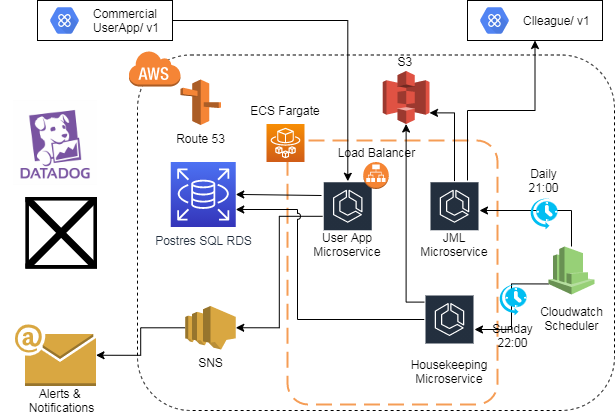

## Commercial Web App Service - User Management

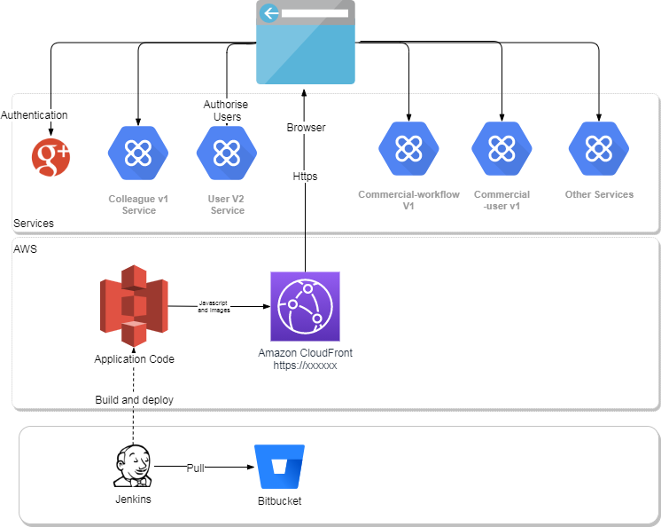

The table below outlines the required capacity for User Management Service components . This table may be updated and refined through the various stages of the lifecycle - specifically after performance testing and some period in production.

<table>
  <tr>
   <td><strong>Solution Component</strong>
   </td>
   <td><strong>Infrastructure Impacted</strong>
   </td>
   <td><strong>ITEM</strong>
   </td>
   <td><strong>Configuration</strong>
   </td>
   <td><strong>Count</strong>
   </td>
   <td><strong>Price</strong>
   </td>
   <td><strong>Total</strong>
   </td>
   <td><strong>Remarks</strong>
   </td>
  </tr>
  <tr>
   <td rowspan="8" >PROD - Commercial
   </td>
   <td rowspan="8" >
   </td>
   <td>Aurora RDS with Autoscaling ON
   </td>
   <td>m4-xlarge
   </td>
   <td>1
   </td>
   <td>$1048.32/month
   </td>
   <td>
   </td>
   <td>NA
   </td>
  </tr>
  <tr>
   <td> \
RDS Storage(GB)
   </td>
   <td>20
   </td>
   <td>1
   </td>
   <td> \
$34.50/month
   </td>
   <td>
   </td>
   <td>
   </td>
  </tr>
  <tr>
   <td> \
RDS Backup(GB)
   </td>
   <td> \
100
   </td>
   <td>1
   </td>
   <td>$13.30/month
   </td>
   <td>
   </td>
   <td>
   </td>
  </tr>
  <tr>
   <td>S3 Bucket
   </td>
   <td>1
   </td>
   <td colspan="2" >$0.023 per GB
   </td>
   <td>
   </td>
   <td>
   </td>
  </tr>
  <tr>
   <td>Cloudwatch Rules
   </td>
   <td> \
5k trigger/month
   </td>
   <td>
   </td>
   <td>$4.00/month
   </td>
   <td>
   </td>
   <td>
   </td>
  </tr>
  <tr>
   <td>Cloudwatch Log Groups
   </td>
   <td> \
1 log group
   </td>
   <td>1
   </td>
   <td> \
$2.85/month
   </td>
   <td>
   </td>
   <td>
   </td>
  </tr>
  <tr>
   <td>SNS
   </td>
   <td>
   </td>
   <td>1
   </td>
   <td>
   </td>
   <td>
   </td>
   <td>
   </td>
  </tr>
  <tr>
   <td>ECS Fargate
   </td>
   <td>1
   </td>
   <td>1
   </td>
   <td>$0.04048/vCPU-Hour

$0.004445/GB-Hour
   </td>
   <td>
   </td>
   <td>
   </td>
  </tr>
  <tr>
   <td>Prod
   </td>
   <td>Apigee
   </td>
   <td colspan="3" >Access Key and Secrets for prod environment, configuration of API endpoints
   </td>
   <td colspan="2" >Cost to be checked.
   </td>
   <td>
   </td>
  </tr>
</table>

## Camunda

### BPMN Process Engine Implementation

The licensing model for Camunda provides great flexibility to choose a deployment model to support specific use cases. The implementation framework is based on Spring Boot services and a serverless shared container Process Engine. This configuration will cater for the specific use cases and complexity of the processes being automated in the Commercial domain.

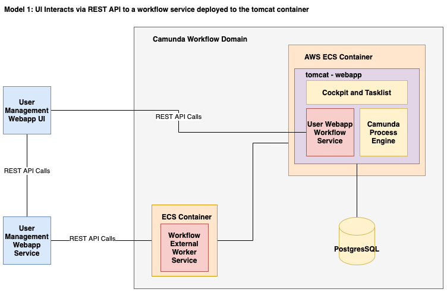

### **Deployment Model**

### Standalone (Remote) Process Engine Server

The process engine will be deployed as a standalone network service. Applications will interact with the User Webapp Workflow Service using the published REST API endpoints. The Camunda Process Engine will be deployed and managed by a Tomcat server within the AWS deployed container. The user webapp workflow service will be deployed and managed by the same Tomcat server via the base url **_[api.morrisons.com/commworkflow/v1/userapp](http://api.morrisons.com/commworkflow/v1)_** as shown below. External REST calls to microservices will be implemented as Java delegate code within the tomcat deployed war file and supplemented by the Workflow External Worker Service.

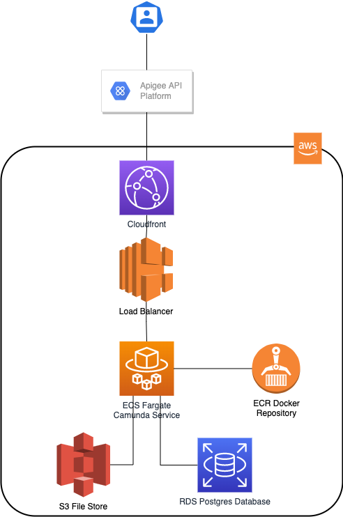

### AWS Fargate

The serverless deployment model for Camunda is based on a docker image of Camunda Enterprise Edition. 

[https://morrisons.atlassian.net/browse/HBTW-247](https://morrisons.atlassian.net/browse/HBTW-247)

This docker image will be stored to an AWS repository (ECR - Elastic Container Registry) which is similar to docker hub.

The docker image is then deployed to AWS Fargate Cluster and configured Task that is sized with appropriate memory and cpu.

Fargate will provide performance and failover management.

Where multiple process engine instances are created for scale-up and fail-over, each process engine instance will connect to a shared database. The individual process engine instances do not maintain session state across transactions. Whenever the process engine runs a transaction, the complete state is flushed out to the shared database. This makes it possible to route subsequent requests which do work in the same process instance to different cluster nodes. This model is very simple and easy to manage.

### Infrastructure

Camunda Platform can run in any Java-runnable environment. The configured infrastructure for this solution is:

* Camunda 7.16.0-ee
* Openjdk11-jre-headless (11.0.9_p11-r0)
* PostgresSQL version 12.6.
* Apache Tomcat Server version number: 9.0.52.0
* Linux OS Version: 5.0.0-23-gene

#### Docker Based Headless Workflow Engine

The implemented workflow engine is based on a Dockerfile build managed via a Jenkins pipeline. An automated Jenkins pipeline of a customised Camunda enterprise edition docker image is built each time a new build of the Camunda BPM platform is required. (1) When the developer updates the Camunda build scripts to the Bitbucket repo, (2) the Jenkins job can be triggered to automatically initiate the build, (3) which fetches all the required Camunda enterprise edition libraries from the secure artifactory repo and (4) automatically deploys the constructed docker container image to AWS ECS. The existing AWS service task is replaced with the new build Camunda container which automatically connects to the PostgresSQL database which provides persistence across multiple instances of a headless Camunda platform.

 [https://jenkins.p.morconnect.com/commercial/view/HBTW/job/commercial-hbtw-camunda-platform/](https://jenkins.p.morconnect.com/commercial/view/HBTW/job/commercial-hbtw-camunda-platform/)

The implemented solution is deployed on the AWS Fargate managed service to provide a serverless Camunda BPM engine which is accessible via RESTful APIs. The selected docker image includes a Tomcat Web Application Server and runs Camunda and all deployed applications as servlets.

### Camunda Engine Hardware & Sizing

The preferred sizing option for Camunda will be the Medium size setup detailed in the table below.

<table>
  <tr>
   <td><strong>Size</strong>
   </td>
   <td><strong>Description</strong>
   </td>
  </tr>
  <tr>
   <td>Small
   </td>
   <td>Supports most use cases, typical server configuration 1-2 CPU cores, 1-8 GB RAM
   </td>
  </tr>
  <tr>
   <td><strong>Medium</strong>
   </td>
   <td><strong>Higher volume environments averaging more than 100 instances per second, typical server configuration 2-4 CPU cores, 4-16 GB RAM</strong>
   </td>
  </tr>
  <tr>
   <td>Large
   </td>
   <td>Extreme volume environment or one where CPU intensive code has been deployed, typical server configuration 4-64 CPU, 16-128 GB RAM
   </td>
  </tr>
</table>

A cluster of two servers will suffice most common projects. The option to scale to a larger configuration will be considered based on experience during NFT Performance Benchmarking if: \
• The system needs to handle more than 100 process instances/second \
• The system needs to support CPU intense delegation code or locally running services like data aggregation or transformation

Load testing of deployed applications is the best approach for determining hardware sizing. Depending on the container the system requires approximately 500 MB to 1 GB of disk space. **Camunda recommends at least 2 GB of storage in order to store enough logs for troubleshooting purposes.**

### Camunda Database

To ensure availability, the Camunda process engine database should be clustered and running on at least two nodes at any given time.

[https://morrisons.atlassian.net/browse/HBTW-248](https://morrisons.atlassian.net/browse/HBTW-248)

A large variety of database management systems (DBMS) is supported. Camunda recommends Oracle or PostgreSQL for production and H2 for development. This design has implmented RDS PostgresSQL solution.

### Database Sizing

The amount of space required on the database takes into account:

1. **History Level**: Turning off history saves a huge amount of tablespace as we only keep current runtime data in the database. However, Camunda recommend to keep it to “FULL” to get the maximum audit logging from the process engine.
2. **Process Variables** must be written to the database (in a serialised form such as JSON). With the history level “FULL,” an entry is inserted into history tables every time a variable is changed, remembering the old value. With big data objects stored and changed often, this requires a lot of space.

The frequency of cleaning up historical data is factored into the database sizing. The real space occupied within the database depends on the configuration and must be monitored to manage the utilised space.

### Development Environment

**Application Service Environment** will comprise of an AWS ECS instance to deploy our Spring Boot Camunda app (2 cpu, 8GB, storage say 1Gb storage with inbound/outbound endpoint access)

**Camunda Headless Environment** will comprise of an AWS Fargate instance to deploy Camunda docker container app (2 cpu, 8GB, storage say 1Gb storage with inbound/outbound endpoint access)

**Camunda Shared Database** will comprise of a Postgres database instance with sufficient capacity (2 cpu, 8GB and 1GB storage) and network access

## Capacity Planning

The table below outlines the required capacity for all components. This table may be updated and refined through the various stages of the life cycle - specifically after performance testing and some period in production. 

<table>
  <tr>
   <td><strong>Solution Component</strong>
   </td>
   <td><strong>Infrastructure Impacted</strong>
   </td>
   <td><strong>Item</strong>
   </td>
   <td><strong>Value</strong>
   </td>
   <td><strong>Link to Relevant Requirements / Tests</strong>
   </td>
  </tr>
  <tr>
   <td>
   </td>
   <td>
   </td>
   <td>
   </td>
   <td>
   </td>
   <td>
   </td>
  </tr>
  <tr>
   <td rowspan="6" >Non - PROD Commercial
   </td>
   <td rowspan="6" >Camunda Workflow Engine
   </td>
   <td>AWS FARGATE

Allocated 2 vCPU \
Memory 8GB \
Ephemeral storage 20GB
   </td>
   <td>850.60 USD
   </td>
   <td>Assumes 10 tasks Per Day over 24 Hours
   </td>
  </tr>
  <tr>
   <td>ECS-EC2 INSTANCE

Instance type t4g.large (LINUX) \
vCPUs 2 \
Memory (GiB) 8 GiB \
Network performance 5 Gigabit

Amazon Elastic Block Storage  \
SSD Storage amount 30GB
   </td>
   <td>37.17 USD
   </td>
   <td>Utilization% per month 100%
   </td>
  </tr>
  <tr>
   <td>ECR

Inbound Data Transfer 1024 GB per month \
Outbound Data Transfer 1024 GB per month
   </td>
   <td>122.88 USD
   </td>
   <td>Amount of data stored 1024 GB per month
   </td>
  </tr>
  <tr>
   <td>ALB
   </td>
   <td>18.40 USD
   </td>
   <td>Single ALB
   </td>
  </tr>
  <tr>
   <td>S3

Inbound Data Transfer 1024 GB per month \
Outbound Data Transfer 1024 GB per month
   </td>
   <td>31.98 USD
   </td>
   <td>Amount of data stored 500 GB per month
   </td>
  </tr>
  <tr>
   <td>RDS PostgresSQL Database
   </td>
   <td>Shared Resource
   </td>
   <td>
   </td>
  </tr>
  <tr>
   <td>PRE - PROD Commercial
   </td>
   <td>Camunda Workflow Engine
   </td>
   <td colspan="3" >Configuration and Prices To Be Confirmed
   </td>
  </tr>
  <tr>
   <td>PROD Commercial
   </td>
   <td>Camunda Workflow Engine
   </td>
   <td colspan="3" >Configuration and Prices To Be Confirmed
   </td>
  </tr>
  <tr>
   <td>
   </td>
   <td>
   </td>
   <td>
   </td>
   <td>
   </td>
   <td>
   </td>
  </tr>
  <tr>
   <td>
   </td>
   <td>
   </td>
   <td>
   </td>
   <td>
   </td>
   <td>
   </td>
  </tr>
</table>

## Capacity Constraints

## Capacity Reporting

## Scalability and Elasticity

## Security Consideration

The Application will access uses SSL for encryption of data and hence will be running under HTTPS.

* **Camunda platform: **The existing AWS service task is replaced with the new build Camunda container which automatically connects to the PostgresSQL database which provides persistence across multiple instances of a headless Camunda platform.
* **Session Management:** Session Timeout will be implemented using Javascript on all pages. Timeout will occur in 15 minutes.

## The Single-page Application development with Responsive and scalability.

In the front-end development, we are using “REACT JS” to consume API service for the functionalities, The react js provide a wide range of features with dependency, we just install and use the feature of that.

We are using the react-router feature to navigate different modules of the project. This feature makes the application access on a single page.

**Responsiveness and scalability: **The application will be accessible from all the device types like a desktop monitor, various Tab, and Mobile devices. We are using a fluid layout and a wide range of CSS and SCSS features to make the application Responsive, In the smallest device like Mobile design and look and feel maybe a little different, and that we will be finalizing while API integration.

# Information Architecture

---

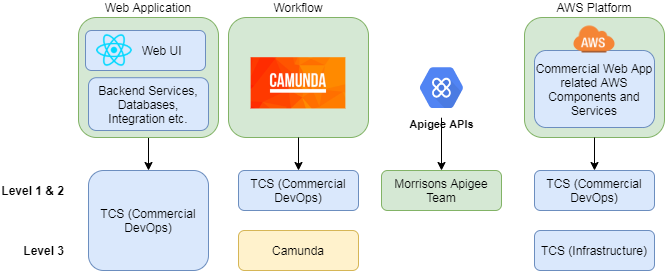

 \
[Commercial Web App Data model](https://docs.google.com/spreadsheets/d/1TO_vhzC49-JDoCfeiS7e63jhGqiOoTp0UytH0DtbTh0/edit?usp=sharing)

# Operations Architecture

---

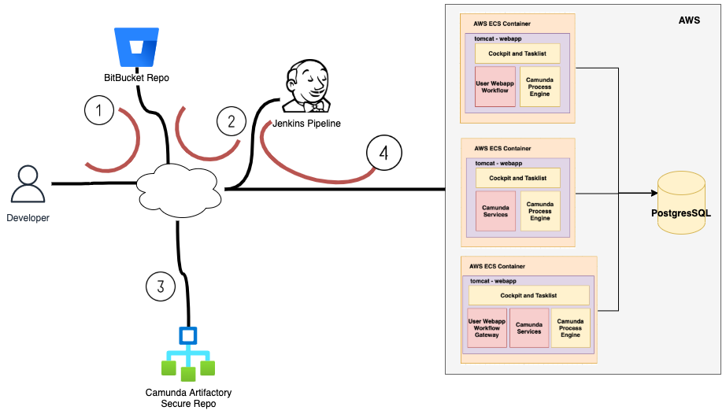

## Security / Compliance

### **User Management Services**

1. API Secret , DB Passwords, AWS Secrets and AWS roles are passed on run time in Jenkins deployment and is kept inside build only. Never stored in Bitbucket or EKS environment variables. It will be not accessible to any Users. Followed through [Application Security Best Practices](file:////wiki/spaces/EA/pages/1111950110/Application+Security+Best+Practices)
2. Cloud Services can be accessed through APIGEE with specified API KEY and Basic AUTH provided for each consumers.
3. The Cloud Services, Item Services, ALB or CNAME URLS are accessible to APIGEE Public IP only.

### Camunda Workflow Service

1. A new secure shared database schema has been created to manage all workflow and BPMN Engine transactions across all instances of Camunda to provide persistence and continuity of service
2. The Camunda service will have a trusted access to services through APIGEE with specified API KEY and Basic AUTH provided for each consumers
3. All user requests will be authenticated and authorised for internal users with a valid Morrisons Google Id. Authorisations will be managed based on the roles and groups to which a user is registered centrally.
4. All URL’s and services will be constrained to internal firewall restricted access.

## Monitoring and Support Architecture

### **User Management Services**

1. The AWS service-related alerts will be configured in Data Dog and SNS. The DevOps team will receive the alerts.

### Camunda Workflow Service

1. All Camunda workflow assumes a stateless operation with a shared database that provides transactional persistence across all instances of Camunda to ensure safe operation in a distributed environbment. Standard database failure and recovery will be provided by the DevOps Team. 
2. The AWS service-related alerts will be managed via the integration with Data Dog. The DevOps team will receive the alerts.

## Maintenance

### **User Management Services**

1. The routine maintenance of the AWS components is the responsibility of the Commercial DevOps team.
2. The Patching and Tagging of AWS components are captured in DevOps backlog, the DevOps team need to implement it in the future.

### Camunda Workflow Service

1. The routine maintenance of the AWS components is the responsibility of the Commercial DevOps team and will be managed via Jenkins pipeline which is parameterised to install the appropriate version of Camunda Releases.
2. The maintenance of the PostgreSQL Database components will be taken care of by the DBA team.
3. The Patching and Tagging of AWS components are captured in DevOps backlog, the DevOps team need to implement it in the future.

## Deployment / Release Management

The detailed design and the deployment process have been captured in the [Camunda TDD](file:////wiki/spaces/HCWCPT/pages/3465448941/01.01.02.03+Technical+Design+-+Camunda).

# Assumptions, Risks, Issues and Decisions

---

<table>
  <tr>
   <td><strong>Type</strong>
   </td>
   <td><strong>Description</strong>
   </td>
   <td><strong>Detail</strong>
   </td>
   <td><strong>Probability</strong>
   </td>
   <td><strong>Impact</strong>
   </td>
   <td><strong>Mitigation</strong>
   </td>
  </tr>
  <tr>
   <td>
   </td>
   <td><em>Link to Jira issue</em>
   </td>
   <td>
   </td>
   <td>
   </td>
   <td>
   </td>
   <td>
   </td>
  </tr>
</table>

# Peer Review

---

All architecture documentation should be peer reviewed. Please complete the tables below for all major versions published. 

## Version 1 Review

Reviewer:

Date:

<table>
  <tr>
   <td><strong>No.</strong>
   </td>
   <td><strong>Feedback Item</strong>
   </td>
   <td><strong>Category</strong>
   </td>
   <td><strong>Remedial Action if Any</strong>
   </td>
   <td><strong>Status</strong>
   </td>
  </tr>
  <tr>
   <td>
   </td>
   <td>
   </td>
   <td>Gap

Pattern

Impact

Technical Debt

Quality (Typo's etc.)
   </td>
   <td>
   </td>
   <td>In Progress / Complete
   </td>
  </tr>
  <tr>
   <td>
   </td>
   <td>
   </td>
   <td>
   </td>
   <td>
   </td>
   <td>
   </td>
  </tr>
</table>

# Document Control

---

<table>
  <tr>
   <td><strong>Version</strong>
   </td>
   <td><strong>Date</strong>
   </td>
   <td><strong>Comment</strong>
   </td>
  </tr>
  <tr>
   <td><strong><a href="file:////wiki/display/HCWCPT/viewpage.action%3fpageId=3303179064">Current Version</a> (v. 114) </strong>
   </td>
   <td><strong>26 Jan, 2022 21:50 </strong>
   </td>
   <td><strong><a href="file:////wiki/people/5b6c5a6be6dba529eefdb77f">Sougata Sarkar</a></strong> 
   </td>
  </tr>
  <tr>
   <td><a href="file:////wiki/display/HCWCPT/viewpage.action%3fpageId=3684532242">v. 113</a> 
   </td>
   <td>20 Jan, 2022 16:16 
   </td>
   <td><a href="file:////wiki/people/5b6c5a6be6dba529eefdb77f">Sougata Sarkar</a>  \
draw.io diagram "Sol Architecture" edited 
   </td>
  </tr>
  <tr>
   <td><a href="file:////wiki/display/HCWCPT/viewpage.action%3fpageId=3674800203">v. 112</a> 
   </td>
   <td>20 Jan, 2022 16:15 
   </td>
   <td><a href="file:////wiki/people/5b6c5a6be6dba529eefdb77f">Sougata Sarkar</a> 
   </td>
  </tr>
  <tr>
   <td><a href="file:////wiki/display/HCWCPT/viewpage.action%3fpageId=3674570873">v. 111</a> 
   </td>
   <td>19 Jan, 2022 09:58 
   </td>
   <td><a href="file:////wiki/people/5b6c5a6be6dba529eefdb77f">Sougata Sarkar</a>  \
draw.io diagram "Sol Architecture" edited 
   </td>
  </tr>
  <tr>
   <td><a href="file:////wiki/display/HCWCPT/viewpage.action%3fpageId=3672965220">v. 110</a> 
   </td>
   <td>19 Jan, 2022 09:58 
   </td>
   <td><a href="file:////wiki/people/5b6c5a6be6dba529eefdb77f">Sougata Sarkar</a> 
   </td>
  </tr>
  <tr>
   <td><a href="file:////wiki/display/HCWCPT/viewpage.action%3fpageId=3673227404">v. 109</a> 
   </td>
   <td>19 Jan, 2022 09:55 
   </td>
   <td><a href="file:////wiki/people/5b6c5a6be6dba529eefdb77f">Sougata Sarkar</a> 
   </td>
  </tr>
  <tr>
   <td><a href="file:////wiki/display/HCWCPT/viewpage.action%3fpageId=3673161869">v. 108</a> 
   </td>
   <td>19 Jan, 2022 09:47 
   </td>
   <td><a href="file:////wiki/people/5b6c5a6be6dba529eefdb77f">Sougata Sarkar</a>  \
draw.io diagram "Sol Context" edited 
   </td>
  </tr>
  <tr>
   <td><a href="file:////wiki/display/HCWCPT/viewpage.action%3fpageId=3672998058">v. 107</a> 
   </td>
   <td>15 Dec, 2021 20:59 
   </td>
   <td><a href="file:////wiki/people/5b6c5a6be6dba529eefdb77f">Sougata Sarkar</a> 
   </td>
  </tr>
  <tr>
   <td><a href="file:////wiki/display/HCWCPT/viewpage.action%3fpageId=3632562601">v. 106</a> 
   </td>
   <td>15 Dec, 2021 16:42 
   </td>
   <td><a href="file:////wiki/people/612fa997f0bf5200694af408">Sal Kabay</a>  \
draw.io diagram "Camunda Dev.drawio" edited 
   </td>
  </tr>
  <tr>
   <td><a href="file:////wiki/display/HCWCPT/viewpage.action%3fpageId=3631579307">v. 105</a> 
   </td>
   <td>15 Dec, 2021 16:42 
   </td>
   <td><a href="file:////wiki/people/612fa997f0bf5200694af408">Sal Kabay</a> 
   </td>
  </tr>
  <tr>
   <td><a href="file:////wiki/display/HCWCPT/viewpage.action%3fpageId=3631415626">v. 104</a> 
   </td>
   <td>09 Dec, 2021 13:12 
   </td>
   <td><a href="file:////wiki/people/612fa997f0bf5200694af408">Sal Kabay</a>  \
draw.io diagram "Sol Context" edited 
   </td>
  </tr>
  <tr>
   <td><a href="file:////wiki/display/HCWCPT/viewpage.action%3fpageId=3622797415">v. 103</a> 
   </td>
   <td>08 Dec, 2021 12:01 
   </td>
   <td><a href="file:////wiki/people/5cd2977f3b428d0dcd7c2881">Sourav Parui</a> 
   </td>
  </tr>
  <tr>
   <td><a href="file:////wiki/display/HCWCPT/viewpage.action%3fpageId=3620241508">v. 102</a> 
   </td>
   <td>06 Dec, 2021 15:36 
   </td>
   <td><a href="file:////wiki/people/5b6c5a6be6dba529eefdb77f">Sougata Sarkar</a> 
   </td>
  </tr>
  <tr>
   <td><a href="file:////wiki/display/HCWCPT/viewpage.action%3fpageId=3616440610">v. 101</a> 
   </td>
   <td>01 Dec, 2021 09:21 
   </td>
   <td><a href="file:////wiki/people/5b6c5a6be6dba529eefdb77f">Sougata Sarkar</a>  \
draw.io diagram "Op Arch" edited 
   </td>
  </tr>
  <tr>
   <td><a href="file:////wiki/display/HCWCPT/viewpage.action%3fpageId=3609886748">v. 100</a> 
   </td>
   <td>19 Nov, 2021 12:24 
   </td>
   <td><a href="file:////wiki/people/612fa997f0bf5200694af408">Sal Kabay</a> 
   </td>
  </tr>
  <tr>
   <td><a href="file:////wiki/display/HCWCPT/viewpage.action%3fpageId=3594616921">v. 99</a> 
   </td>
   <td>19 Nov, 2021 12:23 
   </td>
   <td><a href="file:////wiki/people/612fa997f0bf5200694af408">Sal Kabay</a> 
   </td>
  </tr>
  <tr>
   <td><a href="file:////wiki/display/HCWCPT/viewpage.action%3fpageId=3594846294">v. 98</a> 
   </td>
   <td>10 Nov, 2021 13:49 
   </td>
   <td><a href="file:////wiki/people/5b6c5a6be6dba529eefdb77f">Sougata Sarkar</a>  \
draw.io diagram "User Log In" edited 
   </td>
  </tr>
  <tr>
   <td><a href="file:////wiki/display/HCWCPT/viewpage.action%3fpageId=3581641371">v. 97</a> 
   </td>
   <td>10 Nov, 2021 13:48 
   </td>
   <td><a href="file:////wiki/people/5b6c5a6be6dba529eefdb77f">Sougata Sarkar</a>  \
draw.io diagram "Workflow Use Case" edited 
   </td>
  </tr>
  <tr>
   <td><a href="file:////wiki/display/HCWCPT/viewpage.action%3fpageId=3581084423">v. 96</a> 
   </td>
   <td>10 Nov, 2021 13:47 
   </td>
   <td><a href="file:////wiki/people/5b6c5a6be6dba529eefdb77f">Sougata Sarkar</a>  \
draw.io diagram "Framework Infra Arch - App" edited 
   </td>
  </tr>
  <tr>
   <td><a href="file:////wiki/display/HCWCPT/viewpage.action%3fpageId=3581968953">v. 95</a> 
   </td>
   <td>10 Nov, 2021 12:41 
   </td>
   <td><a href="file:////wiki/people/612fa997f0bf5200694af408">Sal Kabay</a> 
   </td>
  </tr>
  <tr>
   <td><a href="file:////wiki/display/HCWCPT/viewpage.action%3fpageId=3581117217">v. 94</a> 
   </td>
   <td>10 Nov, 2021 09:44 
   </td>
   <td><a href="file:////wiki/people/5cd2977f3b428d0dcd7c2881">Sourav Parui</a> 
   </td>
  </tr>
  <tr>
   <td><a href="file:////wiki/display/HCWCPT/viewpage.action%3fpageId=3581280554">v. 93</a> 
   </td>
   <td>10 Nov, 2021 09:40 
   </td>
   <td><a href="file:////wiki/people/5cd2977f3b428d0dcd7c2881">Sourav Parui</a> 
   </td>
  </tr>
  <tr>
   <td><a href="file:////wiki/display/HCWCPT/viewpage.action%3fpageId=3580887771">v. 92</a> 
   </td>
   <td>10 Nov, 2021 07:03 
   </td>
   <td><a href="file:////wiki/people/612fa997f0bf5200694af408">Sal Kabay</a> 
   </td>
  </tr>
  <tr>
   <td><a href="file:////wiki/display/HCWCPT/viewpage.action%3fpageId=3581116455">v. 91</a> 
   </td>
   <td>10 Nov, 2021 03:47 
   </td>
   <td><a href="file:////wiki/people/61764c1ca9897100703b78c3">amit</a>  \
draw.io diagram "Sol Context" edited 
   </td>
  </tr>
  <tr>
   <td><a href="file:////wiki/display/HCWCPT/viewpage.action%3fpageId=3579217696">v. 90</a> 
   </td>
   <td>10 Nov, 2021 03:47 
   </td>
   <td><a href="file:////wiki/people/61764c1ca9897100703b78c3">amit</a> 
   </td>
  </tr>
  <tr>
   <td><a href="file:////wiki/display/HCWCPT/viewpage.action%3fpageId=3579348966">v. 89</a> 
   </td>
   <td>09 Nov, 2021 23:55 
   </td>
   <td><a href="file:////wiki/people/612fa997f0bf5200694af408">Sal Kabay</a>  \
draw.io diagram "Sol Context" edited 
   </td>
  </tr>
  <tr>
   <td><a href="file:////wiki/display/HCWCPT/viewpage.action%3fpageId=3579348865">v. 88</a> 
   </td>
   <td>09 Nov, 2021 23:55 
   </td>
   <td><a href="file:////wiki/people/612fa997f0bf5200694af408">Sal Kabay</a>  \
Tidied up Camunda references to service rather than app 
   </td>
  </tr>
  <tr>
   <td><a href="file:////wiki/display/HCWCPT/viewpage.action%3fpageId=3580167610">v. 87</a> 
   </td>
   <td>09 Nov, 2021 13:36 
   </td>
   <td><a href="file:////wiki/people/5cd2977f3b428d0dcd7c2881">Sourav Parui</a> 
   </td>
  </tr>
  <tr>
   <td><a href="file:////wiki/display/HCWCPT/viewpage.action%3fpageId=3579937053">v. 86</a> 
   </td>
   <td>09 Nov, 2021 13:24 
   </td>
   <td><a href="file:////wiki/people/61764c1ca9897100703b78c3">amit</a> 
   </td>
  </tr>
  <tr>
   <td><a href="file:////wiki/display/HCWCPT/viewpage.action%3fpageId=3580395708">v. 85</a> 
   </td>
   <td>09 Nov, 2021 13:22 
   </td>
   <td><a href="file:////wiki/people/61764c1ca9897100703b78c3">amit</a> 
   </td>
  </tr>
  <tr>
   <td><a href="file:////wiki/display/HCWCPT/viewpage.action%3fpageId=3579904266">v. 84</a> 
   </td>
   <td>09 Nov, 2021 11:57 
   </td>
   <td><a href="file:////wiki/people/5cd2977f3b428d0dcd7c2881">Sourav Parui</a>  \
draw.io diagram "Sol Architecture" edited 
   </td>
  </tr>
  <tr>
   <td><a href="file:////wiki/display/HCWCPT/viewpage.action%3fpageId=3580231834">v. 83</a> 
   </td>
   <td>09 Nov, 2021 08:36 
   </td>
   <td><a href="file:////wiki/people/60a4f9859b362f006907d603">Sudhir Mahapatra</a> 
   </td>
  </tr>
  <tr>
   <td><a href="file:////wiki/display/HCWCPT/viewpage.action%3fpageId=3579740245">v. 82</a> 
   </td>
   <td>09 Nov, 2021 08:24 
   </td>
   <td><a href="file:////wiki/people/5b6c5a6be6dba529eefdb77f">Sougata Sarkar</a> 
   </td>
  </tr>
  <tr>
   <td><a href="file:////wiki/display/HCWCPT/viewpage.action%3fpageId=3580035084">v. 81</a> 
   </td>
   <td>08 Nov, 2021 18:53 
   </td>
   <td><a href="file:////wiki/people/612fa997f0bf5200694af408">Sal Kabay</a>  \
draw.io diagram "Camunda Dev.drawio" edited 
   </td>
  </tr>
  <tr>
   <td><a href="file:////wiki/display/HCWCPT/viewpage.action%3fpageId=3578233341">v. 80</a> 
   </td>
   <td>08 Nov, 2021 18:53 
   </td>
   <td><a href="file:////wiki/people/612fa997f0bf5200694af408">Sal Kabay</a>  \
Updated draw.io Camunda context diagram 
   </td>
  </tr>
  <tr>
   <td><a href="file:////wiki/display/HCWCPT/viewpage.action%3fpageId=3578331585">v. 79</a> 
   </td>
   <td>08 Nov, 2021 16:23 
   </td>
   <td><a href="file:////wiki/people/5b6c5a6be6dba529eefdb77f">Sougata Sarkar</a> 
   </td>
  </tr>
  <tr>
   <td><a href="file:////wiki/display/HCWCPT/viewpage.action%3fpageId=3578266164">v. 78</a> 
   </td>
   <td>08 Nov, 2021 16:14 
   </td>
   <td><a href="file:////wiki/people/5b6c5a6be6dba529eefdb77f">Sougata Sarkar</a> 
   </td>
  </tr>
  <tr>
   <td><a href="file:////wiki/display/HCWCPT/viewpage.action%3fpageId=3578429844">v. 77</a> 
   </td>
   <td>08 Nov, 2021 16:12 
   </td>
   <td><a href="file:////wiki/people/612fa997f0bf5200694af408">Sal Kabay</a>  \
draw.io diagram "Sol Architecture" edited 
   </td>
  </tr>
  <tr>
   <td><a href="file:////wiki/display/HCWCPT/viewpage.action%3fpageId=3578364270">v. 76</a> 
   </td>
   <td>08 Nov, 2021 12:33 
   </td>
   <td><a href="file:////wiki/people/5cd2977f3b428d0dcd7c2881">Sourav Parui</a> 
   </td>
  </tr>
  <tr>
   <td><a href="file:////wiki/display/HCWCPT/viewpage.action%3fpageId=3577479774">v. 75</a> 
   </td>
   <td>08 Nov, 2021 12:31 
   </td>
   <td><a href="file:////wiki/people/5b6c5a6be6dba529eefdb77f">Sougata Sarkar</a> 
   </td>
  </tr>
  <tr>
   <td><a href="file:////wiki/display/HCWCPT/viewpage.action%3fpageId=3577578033">v. 74</a> 
   </td>
   <td>08 Nov, 2021 12:21 
   </td>
   <td><a href="file:////wiki/people/5b6c5a6be6dba529eefdb77f">Sougata Sarkar</a>  \
draw.io diagram "Service - Infra" edited 
   </td>
  </tr>
  <tr>
   <td><a href="file:////wiki/display/HCWCPT/viewpage.action%3fpageId=3578265916">v. 73</a> 
   </td>
   <td>08 Nov, 2021 12:18 
   </td>
   <td><a href="file:////wiki/people/5b6c5a6be6dba529eefdb77f">Sougata Sarkar</a>  \
draw.io diagram "Service - Infra" edited 
   </td>
  </tr>
  <tr>
   <td><a href="file:////wiki/display/HCWCPT/viewpage.action%3fpageId=3577676291">v. 72</a> 
   </td>
   <td>08 Nov, 2021 11:58 
   </td>
   <td><a href="file:////wiki/people/5b6c5a6be6dba529eefdb77f">Sougata Sarkar</a> 
   </td>
  </tr>
  <tr>
   <td><a href="file:////wiki/display/HCWCPT/viewpage.action%3fpageId=3578102168">v. 71</a> 
   </td>
   <td>08 Nov, 2021 11:58 
   </td>
   <td><a href="file:////wiki/people/5cd2977f3b428d0dcd7c2881">Sourav Parui</a> 
   </td>
  </tr>
  <tr>
   <td><a href="file:////wiki/display/HCWCPT/viewpage.action%3fpageId=3577577990">v. 70</a> 
   </td>
   <td>08 Nov, 2021 11:51 
   </td>
   <td><a href="file:////wiki/people/5cd2977f3b428d0dcd7c2881">Sourav Parui</a> 
   </td>
  </tr>
  <tr>
   <td><a href="file:////wiki/display/HCWCPT/viewpage.action%3fpageId=3578003822">v. 69</a> 
   </td>
   <td>08 Nov, 2021 10:54 
   </td>
   <td><a href="file:////wiki/people/5b6c5a6be6dba529eefdb77f">Sougata Sarkar</a> 
   </td>
  </tr>
  <tr>
   <td><a href="file:////wiki/display/HCWCPT/viewpage.action%3fpageId=3578167588">v. 68</a> 
   </td>
   <td>08 Nov, 2021 09:36 
   </td>
   <td><a href="file:////wiki/people/60a4f9859b362f006907d603">Sudhir Mahapatra</a>  \
draw.io diagram "User Log In" edited 
   </td>
  </tr>
  <tr>
   <td><a href="file:////wiki/display/HCWCPT/viewpage.action%3fpageId=3577872737">v. 67</a> 
   </td>
   <td>07 Nov, 2021 22:03 
   </td>
   <td><a href="file:////wiki/people/612fa997f0bf5200694af408">Sal Kabay</a> 
   </td>
  </tr>
  <tr>
   <td><a href="file:////wiki/display/HCWCPT/viewpage.action%3fpageId=3576990717">v. 66</a> 
   </td>
   <td>07 Nov, 2021 13:32 
   </td>
   <td><a href="file:////wiki/people/5b6c5a6be6dba529eefdb77f">Sougata Sarkar</a>  \
draw.io diagram "Workflow Use Case" edited 
   </td>
  </tr>
  <tr>
   <td><a href="file:////wiki/display/HCWCPT/viewpage.action%3fpageId=3577284063">v. 65</a> 
   </td>
   <td>07 Nov, 2021 13:31 
   </td>
   <td><a href="file:////wiki/people/5b6c5a6be6dba529eefdb77f">Sougata Sarkar</a> 
   </td>
  </tr>
  <tr>
   <td><a href="file:////wiki/display/HCWCPT/viewpage.action%3fpageId=3576990092">v. 64</a> 
   </td>
   <td>07 Nov, 2021 12:52 
   </td>
   <td><a href="file:////wiki/people/5b6c5a6be6dba529eefdb77f">Sougata Sarkar</a>  \
draw.io diagram "Workflow Use Case" edited 
   </td>
  </tr>
  <tr>
   <td><a href="file:////wiki/display/HCWCPT/viewpage.action%3fpageId=3576989957">v. 63</a> 
   </td>
   <td>07 Nov, 2021 12:51 
   </td>
   <td><a href="file:////wiki/people/5b6c5a6be6dba529eefdb77f">Sougata Sarkar</a> 
   </td>
  </tr>
  <tr>
   <td><a href="file:////wiki/display/HCWCPT/viewpage.action%3fpageId=3576694901">v. 62</a> 
   </td>
   <td>07 Nov, 2021 11:27 
   </td>
   <td><a href="file:////wiki/people/5b6c5a6be6dba529eefdb77f">Sougata Sarkar</a> 
   </td>
  </tr>
  <tr>
   <td><a href="file:////wiki/display/HCWCPT/viewpage.action%3fpageId=3576989540">v. 61</a> 
   </td>
   <td>06 Nov, 2021 18:50 
   </td>
   <td><a href="file:////wiki/people/612fa997f0bf5200694af408">Sal Kabay</a> 
   </td>
  </tr>
  <tr>
   <td><a href="file:////wiki/display/HCWCPT/viewpage.action%3fpageId=3577087554">v. 60</a> 
   </td>
   <td>06 Nov, 2021 18:15 
   </td>
   <td><a href="file:////wiki/people/5b6c5a6be6dba529eefdb77f">Sougata Sarkar</a> 
   </td>
  </tr>
  <tr>
   <td><a href="file:////wiki/display/HCWCPT/viewpage.action%3fpageId=3576694250">v. 59</a> 
   </td>
   <td>05 Nov, 2021 21:49 
   </td>
   <td><a href="file:////wiki/people/5b6c5a6be6dba529eefdb77f">Sougata Sarkar</a>  \
draw.io diagram "Sol Architecture" edited 
   </td>
  </tr>
  <tr>
   <td><a href="file:////wiki/display/HCWCPT/viewpage.action%3fpageId=3576988647">v. 58</a> 
   </td>
   <td>05 Nov, 2021 21:49 
   </td>
   <td><a href="file:////wiki/people/5b6c5a6be6dba529eefdb77f">Sougata Sarkar</a> 
   </td>
  </tr>
  <tr>
   <td><a href="file:////wiki/display/HCWCPT/viewpage.action%3fpageId=3576693694">v. 57</a> 
   </td>
   <td>05 Nov, 2021 20:10 
   </td>
   <td><a href="file:////wiki/people/5b6c5a6be6dba529eefdb77f">Sougata Sarkar</a>  \
draw.io diagram "Sol Architecture" edited 
   </td>
  </tr>
  <tr>
   <td><a href="file:////wiki/display/HCWCPT/viewpage.action%3fpageId=3577119381">v. 56</a> 
   </td>
   <td>05 Nov, 2021 20:10 
   </td>
   <td><a href="file:////wiki/people/5b6c5a6be6dba529eefdb77f">Sougata Sarkar</a> 
   </td>
  </tr>
  <tr>
   <td><a href="file:////wiki/display/HCWCPT/viewpage.action%3fpageId=3577152170">v. 55</a> 
   </td>
   <td>05 Nov, 2021 14:34 
   </td>
   <td><a href="file:////wiki/people/612fa997f0bf5200694af408">Sal Kabay</a> 
   </td>
  </tr>
  <tr>
   <td><a href="file:////wiki/display/HCWCPT/viewpage.action%3fpageId=3575644461">v. 54</a> 
   </td>
   <td>05 Nov, 2021 13:41 
   </td>
   <td><a href="file:////wiki/people/612fa997f0bf5200694af408">Sal Kabay</a> 
   </td>
  </tr>
  <tr>
   <td><a href="file:////wiki/display/HCWCPT/viewpage.action%3fpageId=3574793094">v. 53</a> 
   </td>
   <td>05 Nov, 2021 13:23 
   </td>
   <td><a href="file:////wiki/people/612fa997f0bf5200694af408">Sal Kabay</a> 
   </td>
  </tr>
  <tr>
   <td><a href="file:////wiki/display/HCWCPT/viewpage.action%3fpageId=3576299662">v. 52</a> 
   </td>
   <td>05 Nov, 2021 13:17 
   </td>
   <td><a href="file:////wiki/people/612fa997f0bf5200694af408">Sal Kabay</a> 
   </td>
  </tr>
  <tr>
   <td><a href="file:////wiki/display/HCWCPT/viewpage.action%3fpageId=3575710006">v. 51</a> 
   </td>
   <td>05 Nov, 2021 13:13 
   </td>
   <td><a href="file:////wiki/people/612fa997f0bf5200694af408">Sal Kabay</a> 
   </td>
  </tr>
  <tr>
   <td><a href="file:////wiki/display/HCWCPT/viewpage.action%3fpageId=3576037611">v. 50</a> 
   </td>
   <td>05 Nov, 2021 12:53 
   </td>
   <td><a href="file:////wiki/people/612fa997f0bf5200694af408">Sal Kabay</a> 
   </td>
  </tr>
  <tr>
   <td><a href="file:////wiki/display/HCWCPT/viewpage.action%3fpageId=3575873717">v. 49</a> 
   </td>
   <td>05 Nov, 2021 12:48 
   </td>
   <td><a href="file:////wiki/people/612fa997f0bf5200694af408">Sal Kabay</a> 
   </td>
  </tr>
  <tr>
   <td><a href="file:////wiki/display/HCWCPT/viewpage.action%3fpageId=3576135905">v. 48</a> 
   </td>
   <td>05 Nov, 2021 12:46 
   </td>
   <td><a href="file:////wiki/people/612fa997f0bf5200694af408">Sal Kabay</a> 
   </td>
  </tr>
  <tr>
   <td><a href="file:////wiki/display/HCWCPT/viewpage.action%3fpageId=3575546311">v. 47</a> 
   </td>
   <td>05 Nov, 2021 12:34 
   </td>
   <td><a href="file:////wiki/people/612fa997f0bf5200694af408">Sal Kabay</a> 
   </td>
  </tr>
  <tr>
   <td><a href="file:////wiki/display/HCWCPT/viewpage.action%3fpageId=3576135882">v. 46</a> 
   </td>
   <td>05 Nov, 2021 12:18 
   </td>
   <td><a href="file:////wiki/people/612fa997f0bf5200694af408">Sal Kabay</a> 
   </td>
  </tr>
  <tr>
   <td><a href="file:////wiki/display/HCWCPT/viewpage.action%3fpageId=3575382608">v. 45</a> 
   </td>
   <td>05 Nov, 2021 12:03 
   </td>
   <td><a href="file:////wiki/people/612fa997f0bf5200694af408">Sal Kabay</a> 
   </td>
  </tr>
  <tr>
   <td><a href="file:////wiki/display/HCWCPT/viewpage.action%3fpageId=3574793043">v. 44</a> 
   </td>
   <td>05 Nov, 2021 11:47 
   </td>
   <td><a href="file:////wiki/people/612fa997f0bf5200694af408">Sal Kabay</a> 
   </td>
  </tr>
  <tr>
   <td><a href="file:////wiki/display/HCWCPT/viewpage.action%3fpageId=3576299604">v. 43</a> 
   </td>
   <td>05 Nov, 2021 10:10 
   </td>
   <td><a href="file:////wiki/people/5b6c5a6be6dba529eefdb77f">Sougata Sarkar</a>  \
draw.io diagram "Framework Infra Arch - App" edited 
   </td>
  </tr>
  <tr>
   <td><a href="file:////wiki/display/HCWCPT/viewpage.action%3fpageId=3575611651">v. 42</a> 
   </td>
   <td>05 Nov, 2021 10:09 
   </td>
   <td><a href="file:////wiki/people/5b6c5a6be6dba529eefdb77f">Sougata Sarkar</a> 
   </td>
  </tr>
  <tr>
   <td><a href="file:////wiki/display/HCWCPT/viewpage.action%3fpageId=3576004741">v. 41</a> 
   </td>
   <td>04 Nov, 2021 21:30 
   </td>
   <td><a href="file:////wiki/people/5b6c5a6be6dba529eefdb77f">Sougata Sarkar</a>  \
draw.io diagram "Sol Architecture" edited 
   </td>
  </tr>
  <tr>
   <td><a href="file:////wiki/display/HCWCPT/viewpage.action%3fpageId=3574792220">v. 40</a> 
   </td>
   <td>04 Nov, 2021 18:48 
   </td>
   <td><a href="file:////wiki/people/5b6c5a6be6dba529eefdb77f">Sougata Sarkar</a> 
   </td>
  </tr>
  <tr>
   <td><a href="file:////wiki/display/HCWCPT/viewpage.action%3fpageId=3575185409">v. 39</a> 
   </td>
   <td>04 Nov, 2021 09:00 
   </td>
   <td><a href="file:////wiki/people/5b6c5a6be6dba529eefdb77f">Sougata Sarkar</a> 
   </td>
  </tr>
  <tr>
   <td><a href="file:////wiki/display/HCWCPT/viewpage.action%3fpageId=3572630094">v. 38</a> 
   </td>
   <td>03 Nov, 2021 22:14 
   </td>
   <td><a href="file:////wiki/people/5b6c5a6be6dba529eefdb77f">Sougata Sarkar</a> 
   </td>
  </tr>
  <tr>
   <td><a href="file:////wiki/display/HCWCPT/viewpage.action%3fpageId=3572662650">v. 37</a> 
   </td>
   <td>03 Nov, 2021 18:11 
   </td>
   <td><a href="file:////wiki/people/5b6c5a6be6dba529eefdb77f">Sougata Sarkar</a>  \
draw.io diagram "Sol Context" edited 
   </td>
  </tr>
  <tr>
   <td><a href="file:////wiki/display/HCWCPT/viewpage.action%3fpageId=3571941830">v. 36</a> 
   </td>
   <td>03 Nov, 2021 18:11 
   </td>
   <td><a href="file:////wiki/people/5b6c5a6be6dba529eefdb77f">Sougata Sarkar</a> 
   </td>
  </tr>
  <tr>
   <td><a href="file:////wiki/display/HCWCPT/viewpage.action%3fpageId=3572302273">v. 35</a> 
   </td>
   <td>04 Oct, 2021 18:08 
   </td>
   <td><a href="file:////wiki/people/612fa997f0bf5200694af408">Sal Kabay</a> 
   </td>
  </tr>
  <tr>
   <td><a href="file:////wiki/display/HCWCPT/viewpage.action%3fpageId=3524035048">v. 34</a> 
   </td>
   <td>04 Oct, 2021 10:37 
   </td>
   <td><a href="file:////wiki/people/612fa997f0bf5200694af408">Sal Kabay</a> 
   </td>
  </tr>
  <tr>
   <td><a href="file:////wiki/display/HCWCPT/viewpage.action%3fpageId=3520430605">v. 33</a> 
   </td>
   <td>04 Oct, 2021 10:34 
   </td>
   <td><a href="file:////wiki/people/612fa997f0bf5200694af408">Sal Kabay</a> 
   </td>
  </tr>
  <tr>
   <td><a href="file:////wiki/display/HCWCPT/viewpage.action%3fpageId=3524034637">v. 32</a> 
   </td>
   <td>16 Sep, 2021 16:07 
   </td>
   <td><a href="file:////wiki/people/612fa997f0bf5200694af408">Sal Kabay</a> 
   </td>
  </tr>
  <tr>
   <td><a href="file:////wiki/display/HCWCPT/viewpage.action%3fpageId=3491627337">v. 31</a> 
   </td>
   <td>15 Sep, 2021 21:58 
   </td>
   <td><a href="file:////wiki/people/612fa997f0bf5200694af408">Sal Kabay</a> 
   </td>
  </tr>
  <tr>
   <td><a href="file:////wiki/display/HCWCPT/viewpage.action%3fpageId=3491168260">v. 30</a> 
   </td>
   <td>06 Sep, 2021 12:45 
   </td>
   <td><a href="file:////wiki/people/612fa997f0bf5200694af408">Sal Kabay</a> 
   </td>
  </tr>
  <tr>
   <td><a href="file:////wiki/display/HCWCPT/viewpage.action%3fpageId=3471376458">v. 29</a> 
   </td>
   <td>03 Sep, 2021 16:24 
   </td>
   <td><a href="file:////wiki/people/612fa997f0bf5200694af408">Sal Kabay</a> 
   </td>
  </tr>
  <tr>
   <td><a href="file:////wiki/display/HCWCPT/viewpage.action%3fpageId=3467083990">v. 28</a> 
   </td>
   <td>03 Sep, 2021 16:23 
   </td>
   <td><a href="file:////wiki/people/612fa997f0bf5200694af408">Sal Kabay</a> 
   </td>
  </tr>
  <tr>
   <td><a href="file:////wiki/display/HCWCPT/viewpage.action%3fpageId=3467247797">v. 27</a> 
   </td>
   <td>03 Sep, 2021 14:54 
   </td>
   <td><a href="file:////wiki/people/612fa997f0bf5200694af408">Sal Kabay</a> 
   </td>
  </tr>
  <tr>
   <td><a href="file:////wiki/display/HCWCPT/viewpage.action%3fpageId=3467673753">v. 26</a> 
   </td>
   <td>03 Sep, 2021 12:13 
   </td>
   <td><a href="file:////wiki/people/612fa997f0bf5200694af408">Sal Kabay</a> 
   </td>
  </tr>
  <tr>
   <td><a href="file:////wiki/display/HCWCPT/viewpage.action%3fpageId=3467182198">v. 25</a> 
   </td>
   <td>03 Sep, 2021 11:55 
   </td>
   <td><a href="file:////wiki/people/612fa997f0bf5200694af408">Sal Kabay</a> 
   </td>
  </tr>
  <tr>
   <td><a href="file:////wiki/display/HCWCPT/viewpage.action%3fpageId=3467280495">v. 24</a> 
   </td>
   <td>02 Sep, 2021 20:14 
   </td>
   <td><a href="file:////wiki/people/5cd2ce6727454f0fe457985e">Nagesh Viswanathan</a> 
   </td>
  </tr>
  <tr>
   <td><a href="file:////wiki/display/HCWCPT/viewpage.action%3fpageId=3466002781">v. 23</a> 
   </td>
   <td>02 Sep, 2021 19:55 
   </td>
   <td><a href="file:////wiki/people/612fa997f0bf5200694af408">Sal Kabay</a> 
   </td>
  </tr>
  <tr>
   <td><a href="file:////wiki/display/HCWCPT/viewpage.action%3fpageId=3465642440">v. 22</a> 
   </td>
   <td>02 Sep, 2021 19:54 
   </td>
   <td><a href="file:////wiki/people/612fa997f0bf5200694af408">Sal Kabay</a> 
   </td>
  </tr>
  <tr>
   <td><a href="file:////wiki/display/HCWCPT/viewpage.action%3fpageId=3465642415">v. 21</a> 
   </td>
   <td>02 Sep, 2021 19:51 
   </td>
   <td><a href="file:////wiki/people/612fa997f0bf5200694af408">Sal Kabay</a> 
   </td>
  </tr>
  <tr>
   <td><a href="file:////wiki/display/HCWCPT/viewpage.action%3fpageId=3466428735">v. 20</a> 
   </td>
   <td>02 Sep, 2021 19:29 
   </td>
   <td><a href="file:////wiki/people/612fa997f0bf5200694af408">Sal Kabay</a> 
   </td>
  </tr>
  <tr>
   <td><a href="file:////wiki/display/HCWCPT/viewpage.action%3fpageId=3465642381">v. 19</a> 
   </td>
   <td>02 Sep, 2021 19:18 
   </td>
   <td><a href="file:////wiki/people/612fa997f0bf5200694af408">Sal Kabay</a> 
   </td>
  </tr>
  <tr>
   <td><a href="file:////wiki/display/HCWCPT/viewpage.action%3fpageId=3464659726">v. 18</a> 
   </td>
   <td>02 Sep, 2021 18:14 
   </td>
   <td><a href="file:////wiki/people/612fa997f0bf5200694af408">Sal Kabay</a> 
   </td>
  </tr>
  <tr>
   <td><a href="file:////wiki/display/HCWCPT/viewpage.action%3fpageId=3466592623">v. 17</a> 
   </td>
   <td>02 Sep, 2021 18:04 
   </td>
   <td><a href="file:////wiki/people/612fa997f0bf5200694af408">Sal Kabay</a> 
   </td>
  </tr>
  <tr>
   <td><a href="file:////wiki/display/HCWCPT/viewpage.action%3fpageId=3466035535">v. 16</a> 
   </td>
   <td>02 Sep, 2021 17:46 
   </td>
   <td><a href="file:////wiki/people/612fa997f0bf5200694af408">Sal Kabay</a> 
   </td>
  </tr>
  <tr>
   <td><a href="file:////wiki/display/HCWCPT/viewpage.action%3fpageId=3466527059">v. 15</a> 
   </td>
   <td>02 Sep, 2021 17:02 
   </td>
   <td><a href="file:////wiki/people/612fa997f0bf5200694af408">Sal Kabay</a> 
   </td>
  </tr>
  <tr>
   <td><a href="file:////wiki/display/HCWCPT/viewpage.action%3fpageId=3466002724">v. 14</a> 
   </td>
   <td>02 Sep, 2021 16:50 
   </td>
   <td><a href="file:////wiki/people/612fa997f0bf5200694af408">Sal Kabay</a> 
   </td>
  </tr>
  <tr>
   <td><a href="file:////wiki/display/HCWCPT/viewpage.action%3fpageId=3466133874">v. 13</a> 
   </td>
   <td>02 Sep, 2021 16:18 
   </td>
   <td><a href="file:////wiki/people/612fa997f0bf5200694af408">Sal Kabay</a> 
   </td>
  </tr>
  <tr>
   <td><a href="file:////wiki/display/HCWCPT/viewpage.action%3fpageId=3466068244">v. 12</a> 
   </td>
   <td>02 Sep, 2021 16:08 
   </td>
   <td><a href="file:////wiki/people/612fa997f0bf5200694af408">Sal Kabay</a> 
   </td>
  </tr>
  <tr>
   <td><a href="file:////wiki/display/HCWCPT/viewpage.action%3fpageId=3465576772">v. 11</a> 
   </td>
   <td>02 Sep, 2021 16:00 
   </td>
   <td><a href="file:////wiki/people/612fa997f0bf5200694af408">Sal Kabay</a> 
   </td>
  </tr>
  <tr>
   <td><a href="file:////wiki/display/HCWCPT/viewpage.action%3fpageId=3466592574">v. 10</a> 
   </td>
   <td>02 Sep, 2021 15:58 
   </td>
   <td><a href="file:////wiki/people/612fa997f0bf5200694af408">Sal Kabay</a> 
   </td>
  </tr>
  <tr>
   <td><a href="file:////wiki/display/HCWCPT/viewpage.action%3fpageId=3466330462">v. 9</a> 
   </td>
   <td>02 Sep, 2021 11:17 
   </td>
   <td><a href="file:////wiki/people/5b6c5a6be6dba529eefdb77f">Sougata Sarkar</a> 
   </td>
  </tr>
  <tr>
   <td><a href="file:////wiki/display/HCWCPT/viewpage.action%3fpageId=3466231967">v. 8</a> 
   </td>
   <td>01 Sep, 2021 16:26 
   </td>
   <td><a href="file:////wiki/people/5b6c5a6be6dba529eefdb77f">Sougata Sarkar</a> 
   </td>
  </tr>
  <tr>
   <td><a href="file:////wiki/display/HCWCPT/viewpage.action%3fpageId=3464953981">v. 7</a> 
   </td>
   <td>12 Aug, 2021 10:20 
   </td>
   <td><a href="file:////wiki/people/5cd2ce6727454f0fe457985e">Nagesh Viswanathan</a> 
   </td>
  </tr>
  <tr>
   <td><a href="file:////wiki/display/HCWCPT/viewpage.action%3fpageId=3438641177">v. 6</a> 
   </td>
   <td>12 Aug, 2021 10:19 
   </td>
   <td><a href="file:////wiki/people/5cd2ce6727454f0fe457985e">Nagesh Viswanathan</a> 
   </td>
  </tr>
  <tr>
   <td><a href="file:////wiki/display/HCWCPT/viewpage.action%3fpageId=3438575728">v. 5</a> 
   </td>
   <td>11 Aug, 2021 14:28 
   </td>
   <td><a href="file:////wiki/people/5b6c5a6be6dba529eefdb77f">Sougata Sarkar</a> 
   </td>
  </tr>
  <tr>
   <td><a href="file:////wiki/display/HCWCPT/viewpage.action%3fpageId=3436216611">v. 4</a> 
   </td>
   <td>11 Aug, 2021 14:26 
   </td>
   <td><a href="file:////wiki/people/5b6c5a6be6dba529eefdb77f">Sougata Sarkar</a> 
   </td>
  </tr>
  <tr>
   <td><a href="file:////wiki/display/HCWCPT/viewpage.action%3fpageId=3434710881">v. 3</a> 
   </td>
   <td>03 Aug, 2021 23:03 
   </td>
   <td><a href="file:////wiki/people/5b6c5a6be6dba529eefdb77f">Sougata Sarkar</a> 
   </td>
  </tr>
  <tr>
   <td><a href="file:////wiki/display/HCWCPT/viewpage.action%3fpageId=3424288802">v. 2</a> 
   </td>
   <td>28 Jun, 2021 12:30 
   </td>
   <td><a href="file:////wiki/people/5b6c5a6be6dba529eefdb77f">Sougata Sarkar</a> 
   </td>
  </tr>
  <tr>
   <td><a href="file:////wiki/display/HCWCPT/viewpage.action%3fpageId=3303604757">v. 1</a> 
   </td>
   <td>28 Jun, 2021 12:29 
   </td>
   <td><a href="file:////wiki/people/5b6c5a6be6dba529eefdb77f">Sougata Sarkar</a> 
   </td>
  </tr>
</table>
